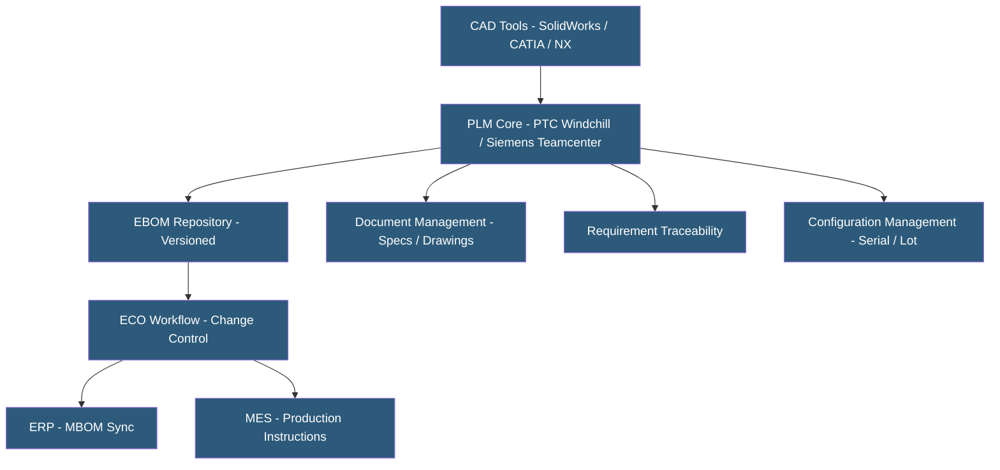

**Category:** Manufacturing & Supply Chain
**Difficulty:** Advanced
**Reading time:** 7 min read

---

Product Lifecycle Management (PLM) systems manage the complete data, processes, and people involved in a product's lifecycle from concept through design, manufacturing, and end-of-life. PLM is the system of record for engineering BOMs, CAD files, specifications, and change history. Cloud-hosted PLM has made enterprise capabilities accessible to mid-market manufacturers, while tighter integration with ERP and MES creates a continuous digital thread connecting product definition to production execution.

- **Digital Thread** — Unbroken data linkage connecting requirements through design, manufacturing, operations, and service for a product
- **EBOM (Engineering BOM)** — Product structure as defined by engineering, reflecting design intent and component relationships
- **PDM (Product Data Management)** — Subset of PLM focused specifically on managing CAD files, drawings, and engineering documents
- **Configuration Management** — Controlling and documenting which components and specifications apply to specific product serialized units
- **ECO (Engineering Change Order)** — Formal process approving and implementing product design changes with full impact analysis
- **MBOM Transformation** — Process of converting the engineering BOM into a manufacturing BOM reflecting factory process sequence
- **Requirement Management** — Capturing and tracing customer requirements to design decisions and test verification evidence
- **Digital Twin Integration** — Connecting PLM product definition to IoT operational data creating a living product model

PLM systems serve as the authoritative repository for product definition data. CAD tools (SolidWorks, CATIA, Creo, NX) integrate with PLM through check-in/check-out workflows, ensuring only one engineer modifies a file at a time and every revision is archived with metadata. The PLM EBOM assembles components from individual CAD models into complete product structures with quantities, find numbers, and specification links.

Change management is PLM's most critical process. When a designer proposes modifying a component, the ECO process formally captures the change, routes it to engineering, manufacturing, quality, and procurement reviewers for impact assessment. Manufacturing reviews whether the change requires tooling updates, production instruction revisions, or work order replanning. Procurement assesses whether alternative suppliers are needed or existing inventory should be consumed first. Only after all approvers sign off is the change released.

EBOM-to-MBOM transformation is a key PLM function in manufacturing-intensive companies. Engineering structures products by form and function; manufacturing structures them by assembly sequence and process flow. PLM manages this transformation, translating engineering assemblies into manufacturing operations, adding process steps invisible in the design, and structuring the output for ERP consumption.

Cloud PLM platforms (PTC Windchill+ hosted, Siemens Xcelerator, Arena PLM, Autodesk Fusion Manage, Onshape) reduce infrastructure burden but require careful evaluation of CAD integration quality and data residency for export-controlled designs (ITAR/EAR compliance in aerospace and defense).

PLM integration with MES creates the digital thread — production workers receive the latest approved work instructions and drawings automatically, eliminating paper-based drawing distribution and reducing risk of production using superseded specifications.

- Discrete manufacturers managing frequent product variants and rapid ECO cycles
- Medical device companies requiring design history file (DHF) and device master record (DMR) compliance
- Aerospace and defense contractors managing configuration baselines for serialized assemblies
- Consumer electronics companies managing rapid product refresh cycles with global design teams
- Companies implementing model-based systems engineering (MBSE) linking requirements to designs

| Advantage | Disadvantage |
|-----------|--------------|
| Single source of truth for product definition eliminates version confusion | Enterprise PLM implementation is a multi-year, multi-million dollar program |
| ECO change control prevents uncontrolled design changes reaching production | CAD/PLM integration requires deep configuration and ongoing maintenance |
| Digital thread connects design to production reducing specification errors | Cloud PLM has limitations for ITAR/EAR-controlled data in some deployments |
| Configuration management enables exact reconstruction of any product serial number | PLM adoption requires significant engineering culture change from email/shared drive workflows |
| PDM integration improves collaboration for global engineering teams | Data migration from legacy PDM or network drives is labor-intensive and risky |

- [Bills of Materials (BOM) Management](bills-of-materials-bom-management.md)
- [CAD File Hosting](cad-file-hosting.md)
- [Engineering Change Management](engineering-change-management.md)

---
*Part of the [Manufacturing & Supply Chain](index.md) category · [Back to Master Index](../../index.md)*
