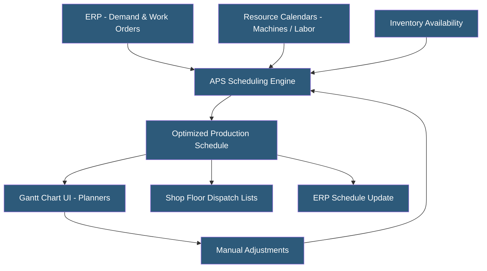

**Category:** Manufacturing & Supply Chain
**Difficulty:** Intermediate
**Reading time:** 6 min read

---

Production scheduling systems determine when and where manufacturing operations execute across machines, work centers, and labor resources to meet delivery commitments while maximizing throughput and minimizing costs. They range from simple infinite-capacity MRP scheduling embedded in ERP systems to dedicated Advanced Planning and Scheduling (APS) engines using constraint-based optimization algorithms. Effective scheduling balances competing priorities: on-time delivery, machine utilization, setup minimization, and inventory levels.

- **Finite Capacity Scheduling** — Scheduling that respects actual machine and labor availability limits, preventing overcommitment
- **Infinite Capacity Scheduling** — MRP-style scheduling that ignores capacity constraints, creating plans that must be manually adjusted
- **APS (Advanced Planning and Scheduling)** — Software using mathematical optimization to generate feasible, near-optimal production sequences
- **Makespan** — Total elapsed time from starting the first job to completing the last, a key scheduling performance metric
- **Setup Time** — Non-productive changeover time between jobs; scheduling systems minimize setups by sequencing similar jobs together
- **Critical Path** — Longest sequence of dependent operations determining the minimum possible completion time for an order
- **Gantt Chart** — Visual timeline showing production operations on a horizontal bar chart by machine or work center
- **Drumbeat Scheduling** — Theory of Constraints (TOC) approach scheduling around the single bottleneck resource

Production scheduling starts with demand: open sales orders, production forecasts, or replenishment triggers. An MRP run or APS engine processes these demands against BOMs and routings to determine what operations need to run on which resources and in what time window.

Finite capacity scheduling assigns operations to specific time slots on specific machines, respecting calendar availability, maintenance windows, and simultaneous resource constraints. When a work center is already loaded, the scheduler moves operations to available slots, extending the schedule horizon or identifying resource conflicts that require management decisions.

APS engines use heuristic algorithms (genetic algorithms, simulated annealing, constraint propagation) to find near-optimal sequences. Objective functions vary: minimizing total lateness, maximizing machine utilization, minimizing setups, or achieving a balanced combination. Dedicated APS tools like Preactor, PlanetTogether, and Siemens Opcenter include built-in optimization solvers that ERP-embedded schedulers lack.

Dispatching rules provide simpler alternatives: FIFO (first in, first out), EDD (earliest due date), SPT (shortest processing time), and SLACK (least time remaining minus processing time). These rules run in real time on the shop floor without complex optimization software.

Schedule stability is a practical challenge — real factories experience machine breakdowns, material shortages, and priority changes continuously. Scheduling systems must reschedule quickly and allow planners to lock critical jobs against automatic rescheduling.

- Job shops with high product mix and variable job sequences needing dynamic scheduling
- Aerospace manufacturers coordinating multi-week production plans across machining and assembly
- Automotive suppliers managing JIT/JIS delivery windows requiring precise schedule accuracy
- Food manufacturers sequencing production to minimize allergen changeover cleaning time
- Semiconductor fabs optimizing wafer flow through hundreds of process steps

| Advantage | Disadvantage |
|-----------|--------------|
| Finite scheduling improves on-time delivery and realistic commitments | APS implementation requires significant data quality investment |
| Minimizing setups through intelligent sequencing reduces costs | Optimization algorithms can produce schedules difficult for planners to understand |
| Visualization tools improve planner productivity | Schedule validity degrades rapidly as shop conditions change |
| Integration with ERP eliminates manual schedule re-entry | Advanced APS software adds licensing costs beyond ERP |
| Constraint-based scheduling identifies real bottlenecks | Requires accurate routing times and resource calendars to be effective |

- [MES (Manufacturing Execution System) Hosting](mes-manufacturing-execution-system-hosting.md)
- [Manufacturing ERP Hosting](manufacturing-erp-hosting.md)
- [Shop Floor Data Collection](shop-floor-data-collection.md)

---
*Part of the [Manufacturing & Supply Chain](index.md) category · [Back to Master Index](../../index.md)*
