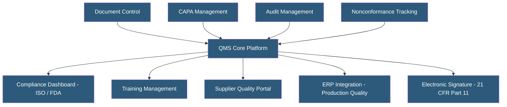

**Category:** Manufacturing & Supply Chain
**Difficulty:** Intermediate
**Reading time:** 6 min read

---

A Quality Management System (QMS) is software managing the processes, documentation, and records required to ensure product quality and regulatory compliance. Cloud-hosted QMS platforms have largely replaced on-premises installations, offering easier access for distributed teams, automatic updates, and built-in compliance validation. Key industries driving QMS adoption include medical devices, pharmaceuticals, automotive, and aerospace, each with distinct regulatory frameworks.

- **Document Control** — Versioned management of quality procedures, work instructions, and specifications with approval workflows
- **CAPA (Corrective and Preventive Action)** — Structured process for investigating quality problems and implementing systemic fixes
- **NCR (Nonconformance Record)** — Documentation of a product or process that fails to meet specifications
- **Audit Management** — Planning, executing, and tracking internal and supplier quality audits
- **Validation (21 CFR Part 11)** — FDA requirement for electronic systems used in pharma/med device to maintain audit trails and electronic signature integrity
- **Change Control** — Formal process for approving, documenting, and implementing changes to products, processes, or systems
- **Risk Management (ISO 14971)** — Systematic process for identifying and mitigating product safety risks, required for medical devices
- **IQ/OQ/PQ** — Installation Qualification, Operational Qualification, Performance Qualification — validation protocols confirming cloud software performs as intended

Cloud QMS platforms are hosted on AWS, Azure, or GCP with dedicated tenants per customer to meet data isolation requirements for regulated industries. Vendors provide detailed IQ/OQ/PQ validation documentation packages allowing customers to validate the hosted system for FDA and EU MDR compliance without testing every software function from scratch.

Document control is the QMS foundation. All quality documents — SOPs, work instructions, forms, specifications — are stored as versioned records with complete revision history. Approval workflows route documents to designated reviewers and approvers, capturing electronic signatures with timestamps and user authentication records to satisfy 21 CFR Part 11 requirements.

When a nonconformance occurs (incoming material fails inspection, production generates scrap, customer complaint received), a nonconformance record is created capturing the problem description, affected product, quantity, and immediate containment action. CAPA workflows link to nonconformances, tracking root cause investigation, corrective actions, effectiveness verification, and closure with evidence.

Audit management schedules internal, customer, and regulatory audits, generates audit checklists, captures audit findings, and tracks finding closure. Supplier quality modules extend audit capabilities to the supply chain, managing supplier qualifications, scorecards, and corrective action requests.

Change control manages product and process changes through formal approval gates, ensuring engineering, quality, manufacturing, and regulatory stakeholders review changes before implementation. Electronic signature requirements prevent unauthorized changes.

Leading platforms include MasterControl, Veeva Vault QMS, Greenlight Guru (medical devices), and Propel (Salesforce-based).

- Medical device manufacturers achieving ISO 13485 and FDA QSR compliance
- Pharmaceutical companies managing GMP documentation and batch records
- Automotive suppliers implementing IATF 16949 quality systems
- Aerospace manufacturers maintaining AS9100 compliance documentation
- Food manufacturers managing FSMA compliance and HACCP plans

| Advantage | Disadvantage |
|-----------|--------------|
| Eliminates paper-based quality records and filing cabinets | Cloud hosting requires thorough validation before use in regulated environments |
| Real-time compliance dashboards for audit readiness | High licensing costs for regulated industry features |
| Automatic audit trails satisfy regulatory traceability requirements | Employee adoption and training require sustained change management |
| Supplier quality portals extend QMS beyond company walls | Integration with ERP and MES requires custom configuration |
| Vendor-managed updates remove IT upgrade burden | Vendor lock-in makes switching platforms difficult with historical quality data |

- [ISO Compliance Management Platforms](iso-compliance-management-platforms.md)
- [MES (Manufacturing Execution System) Hosting](mes-manufacturing-execution-system-hosting.md)
- [Manufacturing ERP Hosting](manufacturing-erp-hosting.md)

---
*Part of the [Manufacturing & Supply Chain](index.md) category · [Back to Master Index](../../index.md)*
