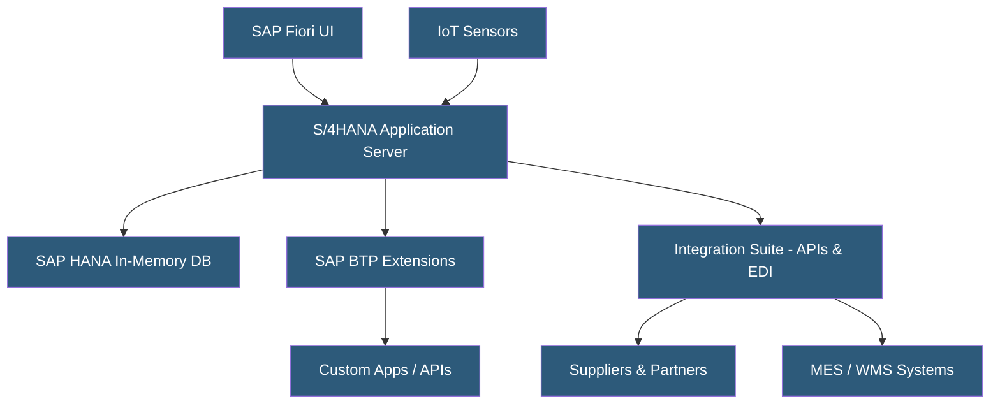

**Category:** Manufacturing & Supply Chain
**Difficulty:** Advanced
**Reading time:** 7 min read

---

SAP S/4HANA Cloud is SAP's flagship cloud ERP built on the in-memory HANA database platform, offering real-time analytics and simplified data models for manufacturing enterprises. It comes in two editions: Public Cloud (multi-tenant SaaS with standardized processes) and Private Cloud (dedicated infrastructure with more customization). The platform unifies production planning, plant maintenance, quality management, and supply chain into a single data model.

- **SAP HANA** — In-memory columnar database eliminating separate OLTP/OLAP systems by processing both transactional and analytical workloads simultaneously
- **Fiori UX** — SAP's role-based web UI framework replacing legacy SAP GUI with responsive apps
- **RISE with SAP** — Bundled offering combining S/4HANA Cloud, infrastructure, and transformation services
- **Business Technology Platform (BTP)** — SAP's extension and integration platform for custom apps, APIs, and AI
- **Universal Journal** — Single accounting table eliminating reconciliation between FI and CO modules
- **MRP Live** — Real-time materials requirements planning running on HANA without batch processing
- **Digital Twin** — Virtual representation of physical assets linking to IoT sensor data in S/4HANA
- **Clean Core** — SAP's principle of extending functionality via BTP rather than modifying core ERP code

SAP S/4HANA Cloud eliminates the traditional separation between transactional databases (OLTP) and reporting databases (OLAP) by running everything in HANA's in-memory columnar store. Transactional data is immediately available for analytics without ETL or replication delays, enabling real-time production dashboards alongside live order processing.

The Public Cloud edition runs on SAP's multi-tenant infrastructure hosted on hyperscaler clouds (AWS, Azure, GCP). Customers use preconfigured best-practice processes and receive quarterly updates automatically. Extensions must be built on BTP using the clean core approach — APIs and event-driven integrations rather than direct ABAP modifications.

Private Cloud edition deploys S/4HANA on dedicated infrastructure, either on SAP-managed hyperscaler tenants or customer-managed environments. This allows more extensive ABAP customization while still running the HANA database.

Manufacturing-specific capabilities include production orders, process orders for batch manufacturing, PP-DS (Production Planning and Detailed Scheduling), and integration with SAP Digital Manufacturing (DMC) for shop floor execution. MRP Live processes large material planning runs in minutes rather than hours by leveraging HANA parallelism.

Data migration from legacy SAP ECC uses LTMC (Legacy Transfer and Migration Cockpit) and SAP Data Migration Service, requiring extensive mapping and validation. Non-SAP migrations involve custom connectors or SAP's migration factory services.

- Large manufacturers replacing SAP ECC 6.0 before its 2027 end-of-maintenance deadline
- Discrete manufacturers needing integrated production planning and financial consolidation
- Chemical and pharmaceutical companies requiring batch management and GMP compliance
- Automotive OEMs needing supplier collaboration and JIT/JIS production integration
- Global enterprises requiring multi-currency, multi-entity financial consolidation

| Advantage | Disadvantage |
|-----------|--------------|
| Real-time analytics without separate BI infrastructure | Among the highest ERP licensing and implementation costs |
| Unified data model eliminates reconciliation overhead | Multi-year implementation timelines for large enterprises |
| Quarterly cloud updates keep functionality current | Public Cloud limits deep customization flexibility |
| Strong ecosystem of certified SAP partners and integrations | Organizational change management is a major implementation risk |
| RISE with SAP simplifies procurement and vendor management | Data migration from legacy systems is complex and expensive |

- [Manufacturing ERP Hosting](manufacturing-erp-hosting.md)
- [Oracle NetSuite Manufacturing](oracle-netsuite-manufacturing.md)
- [MES (Manufacturing Execution System) Hosting](mes-manufacturing-execution-system-hosting.md)

---
*Part of the [Manufacturing & Supply Chain](index.md) category · [Back to Master Index](../../index.md)*
