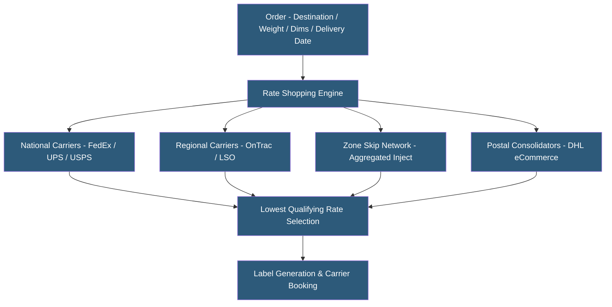

**Category:** Manufacturing & Supply Chain
**Difficulty:** Intermediate
**Reading time:** 5 min read

---

Shipping rate optimization uses algorithms and data analysis to select the lowest-cost carrier and service level for each shipment while meeting delivery commitments. It encompasses carrier contract negotiation strategies, zone skipping, package dimension optimization, regional carrier use, and automated carrier selection rules. Optimized shipping programs can reduce parcel spend by 15–30% compared to default carrier rates.

- **Zone Skipping** — Bypassing early UPS/FedEx sortation zones by transporting aggregated shipments closer to delivery destinations before injecting into the carrier network
- **Regional Carrier** — Smaller carriers (OnTrac, LSO, Spee-Dee) serving specific geographies at lower rates than national carriers for nearby deliveries
- **DIM Weight Optimization** — Minimizing package dimensions or using custom packaging to avoid dimensional weight surcharges
- **Carrier Contract Negotiation** — Securing volume-based discounts, minimum charge reductions, and accessorial cap agreements from national carriers
- **Rate Shopping Engine** — Real-time comparison of carrier rates at shipment creation to select lowest qualifying option
- **Parcel Audit** — Automated verification of carrier invoices to identify billing errors, service failures, and refund opportunities
- **Service Commitment Recovery** — Requesting carrier refunds for late deliveries that violated money-back guarantee service levels
- **Ship From Store** — Fulfilling e-commerce orders from retail store inventory to reduce shipping zone distance to customers

Shipping rate optimization begins with carrier contract analysis. For companies shipping significant volume, direct negotiations with UPS, FedEx, and USPS yield base rate discounts, reduced minimum charges, and accessorial caps. Shipping consultants and platforms like Shipware and 71lbs analyze historical shipment data to benchmark contract quality against market norms and identify negotiation leverage.

Real-time rate shopping compares rates from all contracted carriers and services for each shipment at label creation. Carrier selection rules encode business logic: never use ground for next-day-needed orders; prefer regional carriers in California (OnTrac); use USPS for lightweight residential packages under 1 lb. Modern multi-carrier shipping platforms (EasyPost, ShipBob, ShipStation, Shippo) incorporate these rules into automated carrier selection.

Zone skipping reduces cost for high-volume shippers by aggregating packages destined for a geographic region, transporting them by truck to a regional sort facility, and injecting them into the carrier network closer to the final delivery zone. Instead of a Zone 7 rate (coast-to-coast), the effective rate becomes Zone 3 or 4. This requires minimum volume thresholds (typically 200+ daily packages to a region) to justify aggregation logistics.

DIM weight optimization analyzes packaging dimensions and selects box sizes minimizing dimensional weight charges. Automated packaging optimization systems (Packsize) select or manufacture right-sized boxes per order, reducing DIM weight fees and corrugate material costs.

Parcel audit software (71lbs, Sifted) continuously monitors carrier invoices, automatically claiming refunds for service failures (late deliveries on guaranteed services) and billing errors.

- E-commerce companies spending $500K+ annually on parcel shipping seeking cost reduction
- Retailers implementing ship-from-store fulfillment to reduce zone distance
- Subscription box companies optimizing packaging dimensions to reduce DIM weight
- Companies with carrier contracts expiring seeking competitive negotiation support
- High-volume shippers evaluating zone skipping to reduce coast-to-coast shipping costs

| Advantage | Disadvantage |
|-----------|--------------|
| 15–30% savings achievable with multi-carrier strategy and zone skipping | Complexity increases with more carriers and rules to manage |
| Parcel auditing recovers fees paid for service failures | Zone skipping requires volume thresholds to be cost-effective |
| Regional carriers improve delivery speed for local zones | Customer returns become more complex with multi-carrier outbound |
| DIM weight optimization reduces both freight and packaging costs | Carrier diversification increases tracking and customer communication complexity |
| Data-driven contract negotiation improves carrier deal quality | Rate shopping platform costs must be weighed against savings |

- [Transportation Management Systems](transportation-management-systems-tms.md)
- [Freight Management Platforms](freight-management-platforms.md)
- [Warehouse Management Systems](warehouse-management-systems-wms.md)

---
*Part of the [Manufacturing & Supply Chain](index.md) category · [Back to Master Index](../../index.md)*
