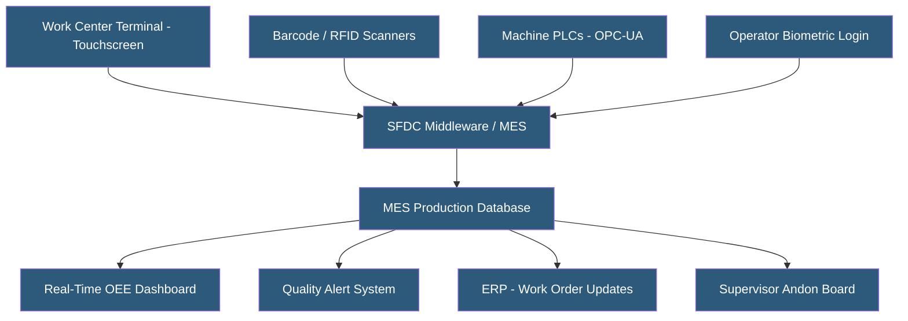

**Category:** Manufacturing & Supply Chain
**Difficulty:** Intermediate
**Reading time:** 6 min read

---

Shop floor data collection (SFDC) captures production, quality, and labor data at manufacturing workstations in real time, feeding MES and ERP systems with accurate operational information. It replaces paper travelers and end-of-shift batch reporting with immediate digital capture through touchscreen terminals, barcode scanners, RFID readers, and machine PLC connections. Real-time SFDC eliminates the 8–24 hour reporting lag that obscures production problems until the next day's management review.

- **Work Center Terminal** — Touchscreen or industrial PC at a production workstation for operator data entry and work instruction display
- **Barcode Scanning** — Reading 1D or 2D barcodes on components, labels, and containers to capture material movements
- **RFID (Radio Frequency Identification)** — Wireless tag technology enabling automated material tracking without manual scanning
- **Machine Integration** — Direct PLC/OPC-UA connection collecting cycle counts, downtime events, and process parameters automatically
- **Operator Login** — Identifying which worker is at a station for labor tracking, training verification, and audit trail creation
- **Production Reporting** — Operator confirmation of quantities produced, scrapped, and reworked at each operation
- **Electronic Travelers** — Digital replacement for paper router cards following jobs through the shop with digital sign-offs at each operation
- **Andon System** — Signal system (lights, sounds, digital boards) alerting supervisors to production problems requiring immediate response

SFDC systems deploy terminals at every production workstation — typically ruggedized industrial tablets or panel PCs mounted on articulating arms for ergonomic positioning. When a production job arrives at a workstation, the operator scans the job traveler barcode or selects it on the terminal. The terminal displays the work instruction, required components to scan, and data entry fields for quantities and quality measurements.

Machine integration provides the most valuable SFDC data. OPC-UA connections to machine PLCs read cycle counters, fault codes, and process parameters (temperature, pressure, speed) at configurable polling intervals (1–60 seconds). Machine cycle counts feed production counters without operator involvement, eliminating under-reporting. Fault codes automatically create downtime events with machine-generated reason codes, enabling accurate OEE calculation.

For operations without machine connectivity, operators manually report production completion, quality failures, and downtime. Reason code selection menus replace free-text entry, enforcing consistent categorization for Pareto analysis. Voice-guided picking systems in assembly areas allow hands-free data capture.

RFID automates material tracking at points where barcode scanning is impractical — finished goods conveyors, raw material racks, and shipping docks. Active RFID tags on containers update location databases as they move past antenna readers, providing real-time inventory maps without manual scanning.

SFDC data feeds are the input to OEE calculations, quality SPC charts, labor efficiency reporting, and production scheduling feedback. The investment in SFDC infrastructure pays through visibility that enables faster problem detection and resolution.

- Automotive manufacturers implementing real-time production tracking against customer Kanban schedules
- Electronics assembly lines capturing component serial numbers for completed unit genealogy
- Food processors recording production temperatures and batch parameters for HACCP compliance
- Job shops replacing paper travelers with digital routing cards and electronic sign-offs
- Manufacturers implementing OEE improvement programs requiring reliable downtime data

| Advantage | Disadvantage |
|-----------|--------------|
| Real-time data eliminates production reporting lag | Terminal deployment and factory network infrastructure investment |
| Machine integration eliminates manual counting errors | OPC-UA integration complexity varies by machine age and PLC type |
| Accurate OEE data identifies hidden capacity and prioritizes improvement | Operator training and adoption is the most common implementation challenge |
| Complete electronic records support quality traceability and recalls | Industrial terminal hardware is more expensive than consumer-grade devices |
| Immediate quality alerts enable rapid containment before large scrap events | Legacy equipment without PLCs requires alternative data collection approaches |

- [MES (Manufacturing Execution System) Hosting](mes-manufacturing-execution-system-hosting.md)
- [OEE (Overall Equipment Effectiveness) Tracking](oee-overall-equipment-effectiveness-tracking.md)
- [Production Scheduling Systems](production-scheduling-systems.md)

---
*Part of the [Manufacturing & Supply Chain](index.md) category · [Back to Master Index](../../index.md)*
