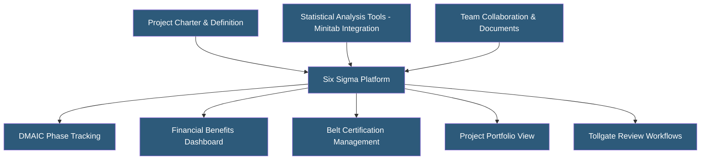

**Category:** Manufacturing & Supply Chain
**Difficulty:** Intermediate
**Reading time:** 5 min read

---

Six Sigma project management hosting platforms provide structured tools for managing DMAIC (Define-Measure-Analyze-Improve-Control) improvement projects, statistical analysis, and knowledge management across an organization's continuous improvement program. These platforms track project portfolios, store statistical analyses, manage team certifications (Green Belt, Black Belt), and calculate financial benefits from completed projects. They range from dedicated Six Sigma tools to broader continuous improvement platforms.

- **DMAIC** — Six Sigma's five-phase improvement methodology: Define (problem/goal), Measure (baseline), Analyze (root cause), Improve (solution), Control (sustain)
- **DPMO (Defects Per Million Opportunities)** — Six Sigma performance metric; 3.4 DPMO represents Six Sigma quality level
- **Control Chart** — Statistical chart monitoring process output over time to distinguish special cause from common cause variation
- **Gage R&R (Gage Repeatability and Reproducibility)** — Statistical study validating measurement system accuracy before project measurement phase
- **Design of Experiments (DOE)** — Statistical method systematically varying multiple factors to identify their effects on output
- **Critical to Quality (CTQ)** — Customer-defined requirements cascaded into measurable process parameters
- **Financial Benefits Tracking** — Quantifying hard savings (cost reduction, defect elimination) and soft benefits from completed projects
- **Tollgate Review** — Formal phase-gate review at each DMAIC stage requiring sponsor approval before proceeding

Six Sigma platforms provide project workspaces structured around the DMAIC methodology. Each project begins with a charter capturing the problem statement, project scope, team members, business impact, and timeline. Automated tollgate checklists ensure each phase produces required deliverables before the team advances.

Statistical analysis integration is central — platforms either embed statistical tools (control charts, regression, hypothesis testing, DOE) or integrate with dedicated statistical software like Minitab. Data upload functionality allows practitioners to analyze process data directly within the project workspace, attaching results as evidence.

Project portfolio dashboards give leadership visibility into all active improvement projects, their phase status, expected completion dates, and projected financial benefits. This visibility helps prioritize resources (belt assignments, sponsor time) and demonstrates CI program ROI.

Belt certification management tracks training completion, project sign-offs, and exam results for Green Belt and Black Belt candidates. Projects often double as certification requirements, so the platform links project completion evidence to certification records.

Knowledge management captures completed project templates, best-practice analyses, and control plans in searchable repositories. When a new project addresses a similar problem, practitioners can find relevant prior work rather than starting from scratch.

Leading platforms include Minitab Connect, Planview Improve, InfinityQS, and Qualité systems. Many organizations use customized SharePoint or Teams workspaces as a simpler alternative.

- Manufacturing quality departments tracking DMAIC projects across multiple plants
- Companies running Lean Six Sigma programs requiring executive financial reporting
- Organizations managing belt certifications and ensuring project completion requirements
- Process improvement teams sharing reusable tools and completed project templates
- Operations leaders needing portfolio visibility across dozens of concurrent improvement initiatives

| Advantage | Disadvantage |
|-----------|--------------|
| Structured DMAIC workflows guide practitioners through methodology | Overhead of platform management may slow small-scale projects |
| Financial benefit tracking demonstrates CI program business value | Statistical analysis depth varies — may still require Minitab or JMP |
| Centralized knowledge base prevents reinventing solutions | Employee adoption requires ongoing coaching and leadership reinforcement |
| Belt certification tracking simplifies workforce development management | Platform cost must be justified by savings from completed projects |
| Portfolio dashboards enable resource prioritization decisions | Not suitable as a replacement for genuine practitioner skill development |

- [ISO Compliance Management Platforms](iso-compliance-management-platforms.md)
- [Quality Management System (QMS) Hosting](quality-management-system-qms-hosting.md)
- [OEE (Overall Equipment Effectiveness) Tracking](oee-overall-equipment-effectiveness-tracking.md)

---
*Part of the [Manufacturing & Supply Chain](index.md) category · [Back to Master Index](../../index.md)*
