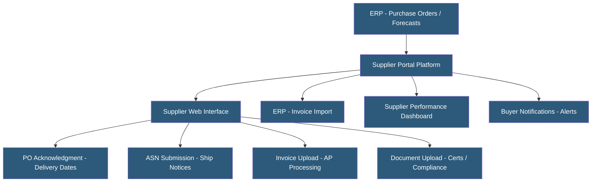

**Category:** Manufacturing & Supply Chain
**Difficulty:** Intermediate
**Reading time:** 5 min read

---

Supplier portals provide web-based interfaces for suppliers to view purchase orders, acknowledge deliveries, submit invoices, upload compliance documents, and communicate with buyers. Cloud-hosted supplier portals replace email-based supply chain communication with structured, auditable workflows. They improve supply chain visibility, reduce AP invoice processing costs, and support supplier qualification and performance management programs.

- **Self-Service Invoice Submission** — Suppliers uploading invoice data directly into the portal, reducing AP data entry and processing time
- **PO Acknowledgment** — Supplier confirmation of purchase order receipt, committed quantities, and delivery dates
- **ASN (Advance Ship Notice)** — Pre-shipment notification submitted by suppliers through the portal with packing details and tracking
- **Supplier Onboarding** — Process of registering, validating, and configuring new suppliers including document collection and system setup
- **Supplier Scorecard** — Performance dashboard showing delivery, quality, and compliance metrics for each supplier
- **Collaborative Forecasting** — Sharing demand forecasts with suppliers so they can plan capacity and material procurement
- **Supplier Self-Service** — Portal capabilities allowing suppliers to update their own profile, banking, and compliance information without buyer intervention
- **PunchOut Catalog** — Integration enabling buyers to shop supplier catalogs within their procurement system, generating purchase orders automatically

Supplier portals act as the outward-facing layer of a company's procurement and supply chain systems, exposing selective ERP data to suppliers in a structured, self-service interface. When a buyer creates a purchase order in the ERP, it is automatically published to the supplier portal where the supplier logs in to view order details, acknowledge the order, and commit to delivery dates.

Suppliers submit advance ship notices through the portal as goods are shipped, providing packing list details, carrier tracking, and expected arrival. ASN data flows automatically into the WMS or receiving department, enabling pre-receiving planning and faster dock processing. Invoice submission through the portal captures structured invoice data eliminating PDF/email-based manual entry, reducing AP processing cost from ~$15 per invoice to under $3.

Document management capabilities handle compliance requirements: suppliers upload insurance certificates, quality certifications (ISO 9001, IATF 16949), country of origin declarations, material safety data sheets, and diversity certificates. Expiration alerts notify buyers and suppliers when documents are approaching renewal, preventing compliance lapses.

Collaborative forecasting shares rolling demand forecasts with strategic suppliers, giving them 12–26 weeks of visibility to plan their own production and procurement. Suppliers can respond with supply commitments against the forecast, creating a collaborative demand-supply matching process.

Leading platforms include SAP Ariba Supplier Portal, Oracle Supplier Portal, Coupa, Jaggaer, and Tradeshift. Mid-market companies use platforms like Anvyl or vendor-specific portals embedded in procurement tools like Procurify.

- Manufacturers with 50+ suppliers seeking to automate PO and invoice processing
- Companies requiring supplier compliance documentation for regulatory audits
- Organizations implementing Lean supply chain programs needing accurate ASN data
- Automotive and aerospace companies managing extensive supplier qualification requirements
- Retail buyers managing seasonal inventory commitments with supplier collaboration

| Advantage | Disadvantage |
|-----------|--------------|
| Structured workflows replace chaotic email communication | Supplier adoption requires training and change management effort |
| AP invoice automation reduces per-invoice processing cost significantly | Smaller suppliers may resist portal requirements if they serve many buyers |
| ASN data enables faster receiving and planning | Portal maintenance and support for supplier questions requires staff time |
| Compliance document management reduces audit preparation time | Integration with ERP and AP systems requires technical implementation |
| Performance scorecards support data-driven supplier management | Portal fees may be passed to suppliers causing relationship friction |

- [Vendor Management Systems](vendor-management-systems.md)
- [EDI (Electronic Data Interchange) Hosting](edi-electronic-data-interchange-hosting.md)
- [Procurement Platform Hosting](procurement-platform-hosting.md)

---
*Part of the [Manufacturing & Supply Chain](index.md) category · [Back to Master Index](../../index.md)*
