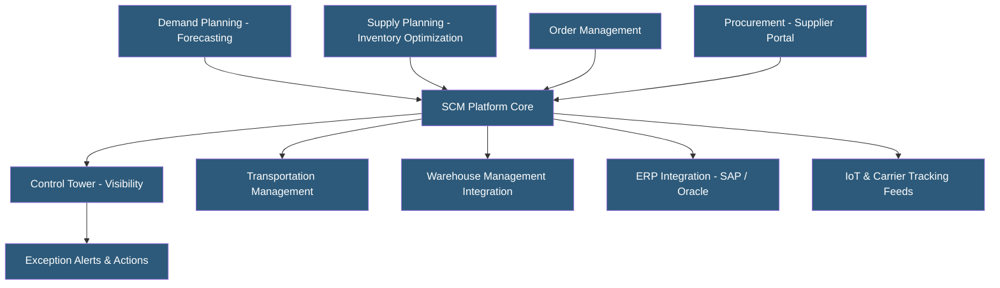

**Category:** Manufacturing & Supply Chain
**Difficulty:** Intermediate
**Reading time:** 7 min read

---

Supply Chain Management (SCM) platforms provide end-to-end visibility and coordination across procurement, manufacturing, logistics, and distribution networks. They integrate demand sensing, supply planning, order management, and transportation into a unified platform, replacing fragmented spreadsheets and siloed ERP modules. Modern cloud SCM platforms leverage AI for demand forecasting, real-time IoT tracking, and risk sensing from external data sources.

- **Supply Chain Visibility** — Real-time tracking of orders, shipments, and inventory across all supply chain nodes
- **Demand Sensing** — Using near-term signals (POS data, social trends, weather) to adjust short-term demand forecasts
- **Supply Planning** — Determining what to produce, purchase, or transfer to meet demand while optimizing inventory levels
- **S&OP (Sales and Operations Planning)** — Monthly cross-functional process aligning demand plans with supply capacity
- **Multi-echelon Inventory Optimization** — Simultaneously optimizing stock levels at all warehouse tiers in a distribution network
- **Control Tower** — Centralized visibility dashboard aggregating supply chain events, exceptions, and KPIs
- **Digital Twin** — Virtual model of the supply network used for scenario simulation and risk analysis
- **Risk Management** — Identifying and mitigating supply disruption risks including supplier failures, logistics delays, and natural disasters

Modern SCM platforms operate as cloud-hosted orchestration layers that integrate data from ERPs, logistics providers, IoT sensors, and external market data. Unlike traditional ERP supply chain modules limited to internal data, dedicated SCM platforms ingest external signals to improve forecast accuracy and supply planning.

Demand planning uses statistical forecasting (time series decomposition, regression, machine learning) combined with human override capabilities for promotions, new product launches, and known disruptions. Consensus demand planning workflows gather input from sales, marketing, and finance to produce a single agreed demand plan.

Supply planning translates the demand plan into material and capacity requirements. Multi-echelon inventory optimization simultaneously calculates optimal safety stock levels at distribution centers, regional warehouses, and manufacturing sites, considering service level targets, lead time variability, and holding costs.

The control tower aggregates data from carrier APIs, port status feeds, weather services, and supplier portals to provide real-time visibility into every shipment. Exception management automatically flags orders at risk of late delivery, low inventory situations, or supplier disruptions, routing alerts to responsible planners.

Risk management modules monitor supplier financial health, geopolitical events, and logistics disruptions using external data feeds. Scenario modeling allows planners to simulate the impact of a supplier failure or port disruption and evaluate alternative sourcing options before a crisis occurs.

Leading platforms include Blue Yonder, o9 Solutions, Kinaxis RapidResponse, SAP Integrated Business Planning, and Oracle Fusion SCM.

- Consumer goods companies managing high-volume, seasonal demand with complex distribution networks
- Automotive manufacturers coordinating multi-tier supplier networks for JIT production
- Retail chains optimizing inventory across hundreds of stores with perishable products
- Electronics companies managing component supply risks in volatile semiconductor markets
- Pharmaceutical companies ensuring continuous supply of critical medications

| Advantage | Disadvantage |
|-----------|--------------|
| End-to-end visibility replaces blind spots in fragmented systems | Implementation costs are substantial (months to years, millions in investment) |
| AI-powered forecasting improves accuracy over traditional statistical methods | Data quality requirements are demanding; garbage in, garbage out |
| Control tower reduces firefighting with proactive exception management | Integration complexity with multiple ERPs and logistics partners |
| Scenario planning enables proactive risk mitigation | Change management for cross-functional S&OP adoption is difficult |
| Multi-echelon optimization reduces total inventory while maintaining service | Ongoing subscription costs significant for mid-market companies |

- [Demand Forecasting Systems](demand-forecasting-systems.md)
- [Inventory Optimization Platforms](inventory-optimization-platforms.md)
- [Transportation Management Systems](transportation-management-systems-tms.md)

---
*Part of the [Manufacturing & Supply Chain](index.md) category · [Back to Master Index](../../index.md)*
