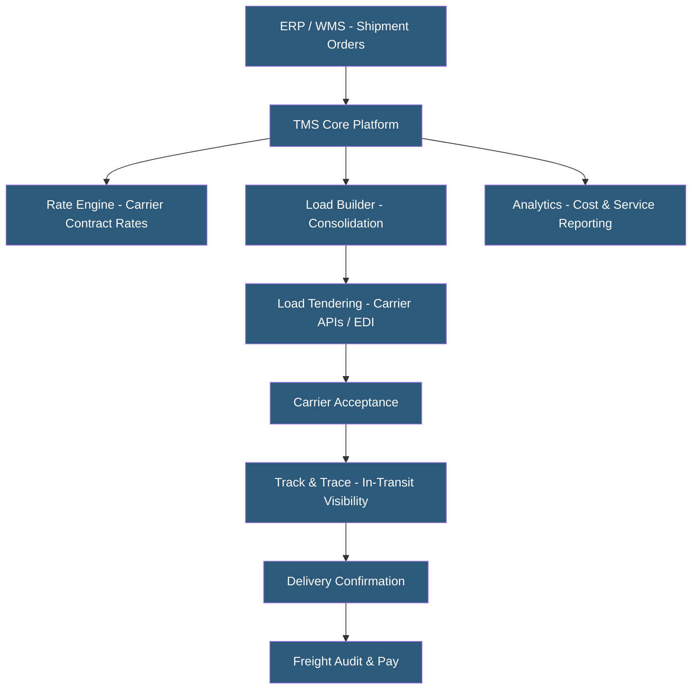

**Category:** Manufacturing & Supply Chain
**Difficulty:** Intermediate
**Reading time:** 6 min read

---

A Transportation Management System (TMS) plans, executes, and optimizes the physical movement of goods across carriers, modes, and geographies. TMS platforms consolidate shipment planning, carrier rate shopping, freight audit, and tracking into a single platform, reducing transportation costs by 5–20% through mode optimization, load consolidation, and carrier contract enforcement. Cloud-hosted TMS has made advanced freight optimization accessible beyond Fortune 500 companies.

- **Load Tendering** — Process of offering a shipment to carriers and receiving acceptance or rejection responses
- **Freight Audit** — Verification that carrier invoices match contracted rates and actual shipment characteristics
- **Mode Optimization** — Selecting lowest-cost transportation mode (parcel, LTL, FTL, intermodal, air) meeting delivery requirements
- **Load Building** — Consolidating multiple shipments or orders into full truckloads to minimize per-unit freight cost
- **Carrier Scorecard** — Performance tracking measuring carrier on-time delivery, claim rates, and responsiveness
- **NMFC Classification** — National Motor Freight Classification system used in US LTL freight pricing
- **Spot Market Procurement** — Real-time capacity procurement for shipments not covered by contracted carrier rates
- **Track and Trace** — Real-time shipment location monitoring using carrier APIs, EDI 214, or GPS telematics

A TMS begins its value delivery at shipment planning. When orders are released from the WMS or ERP, the TMS receives shipment details (origin, destination, weight, dimensions, commodity, delivery date). The rate engine queries contracted carrier rates from all eligible carriers and modes, returning cost and transit time options. The system applies configurable business rules (prefer own fleet, avoid premium air except for emergency, require temperature control for certain product types) to select the optimal carrier and mode.

Load building consolidates individual shipments into trailer loads when shipments are going to the same geographic area or customer. Full truckloads are significantly cheaper per unit than LTL shipments — consolidating three LTL shipments into one FTL can reduce freight cost by 30–40%.

Electronic load tendering sends shipment details to carriers via EDI 204 (load tender) and receives EDI 990 (tender response) confirmations automatically. API-based tendering with digital freight brokers (Convoy, Echo, Coyote) enables real-time spot market procurement when contract carriers decline.

Track-and-trace uses EDI 214 status updates, carrier API webhooks, and GPS telematics to provide real-time shipment location and estimated arrival. Proactive delay alerts notify customer service and supply chain teams when shipments are running behind schedule.

Freight audit and payment validates carrier invoices against contracted rates and actual shipment weights/dimensions. Discrepancy workflows route invoices requiring manual review. Automated payment processing reduces freight payables cycle time from weeks to days.

- Manufacturers shipping high volumes outbound to distribution centers or customers
- Retailers managing inbound freight from hundreds of global suppliers
- 3PLs offering freight management services on behalf of shipper clients
- E-commerce companies optimizing parcel rates across multiple carriers
- Companies managing complex multi-modal international freight

| Advantage | Disadvantage |
|-----------|--------------|
| Rate shopping across all carriers reduces freight spend 5–20% | Implementation requires carrier rate loading and EDI setup time |
| Automated tendering reduces manual dispatch workload | Integration with WMS and ERP requires IT effort |
| Freight audit catches billing errors (typically 2–5% of invoices) | Carrier connectivity depends on carrier EDI or API capabilities |
| In-transit visibility reduces customer service inquiry volume | TMS ROI requires sufficient freight volume to justify platform cost |
| Analytics identify cost reduction and service improvement opportunities | Carrier rate negotiation quality still determines maximum savings |

- [Freight Management Platforms](freight-management-platforms.md)
- [Warehouse Management Systems](warehouse-management-systems-wms.md)
- [Supply Chain Management Platforms](supply-chain-management-platforms.md)

---
*Part of the [Manufacturing & Supply Chain](index.md) category · [Back to Master Index](../../index.md)*
