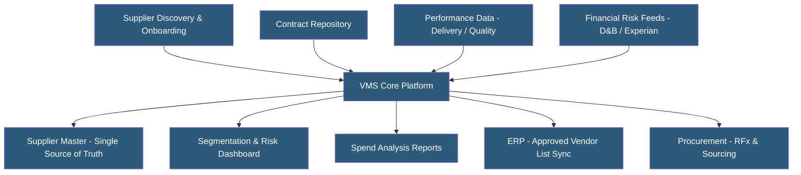

**Category:** Manufacturing & Supply Chain
**Difficulty:** Intermediate
**Reading time:** 5 min read

---

Vendor Management Systems (VMS) centralize supplier information, qualifications, contracts, performance data, and risk assessments in a single platform. They go beyond transactional supplier portals by managing the full supplier lifecycle from discovery and onboarding through performance monitoring and off-boarding. VMS platforms support procurement strategy by enabling data-driven supplier rationalization, risk diversification, and strategic partnership development.

- **Supplier Lifecycle Management** — End-to-end management of supplier relationships from initial qualification to contract renewal or termination
- **Supplier Segmentation** — Classifying suppliers by strategic importance and spend to allocate management attention and resources appropriately
- **Supplier Risk Assessment** — Evaluating supplier financial stability, geographic risk, quality performance, and compliance posture
- **Preferred Supplier Program** — Formal program designating approved vendors meeting quality, price, and compliance requirements
- **Spend Analysis** — Aggregating and categorizing purchase transactions to understand total spend by supplier, category, and business unit
- **Contract Management** — Storing and managing supplier contracts with expiration alerts, milestone tracking, and version control
- **D&B (Dun & Bradstreet) Integration** — Connecting to D&B data for supplier financial health monitoring and risk scoring
- **Contingency Sourcing** — Qualifying backup suppliers for critical categories to reduce single-source dependency risk

VMS platforms create a centralized supplier master record aggregating information from multiple sources: onboarding questionnaires, ERP purchase data, quality system inspection results, compliance document repositories, and external risk data providers. This master record becomes the authoritative source for approved vendor lists published to ERP systems.

Supplier onboarding workflows guide new vendors through a structured process: collecting company information, certifications, insurance, banking details, and completing qualification questionnaires. Risk screening checks against sanctions lists, financial stability scores, and geographic risk indicators before approving suppliers.

Performance management continuously scores suppliers against delivery, quality, responsiveness, and pricing metrics. Automated scorecards aggregate data from ERP (on-time delivery, purchase price variance), quality systems (defect rates, return-to-vendor events), and buyer surveys. Scorecard results feed into segmentation decisions — whether to expand, maintain, or reduce business with specific suppliers.

Risk monitoring uses integration with D&B, Experian, or specialized supply chain risk platforms (Resilinc, Riskmethods) to continuously monitor supplier financial health, news sentiment, and geographic disruption risks. Alerts trigger when a key supplier's financial rating deteriorates or a natural disaster affects their production region.

Contract management stores fully executed agreements with automated renewal reminders, obligation tracking, and pricing tier management. When contracts expire or pricing commitments are missed, procurement teams are alerted before business impact occurs.

- Manufacturing companies managing 100+ suppliers needing systematic performance tracking
- Companies facing supply disruptions wanting better single-source dependency visibility
- Enterprises managing supplier compliance requirements across multiple regulatory domains
- Procurement teams seeking spend visibility to identify consolidation opportunities
- Organizations implementing supplier diversity programs requiring spend tracking and reporting

| Advantage | Disadvantage |
|-----------|--------------|
| Centralized supplier data improves decision-making quality | Implementation requires data cleansing of existing supplier records |
| Automated risk monitoring enables proactive supply chain risk management | Supplier onboarding data collection requires supplier cooperation |
| Performance scorecards enable data-driven supplier development discussions | Financial risk data subscriptions add ongoing licensing costs |
| Contract expiration management prevents costly contract lapses | Building supplier segmentation strategy requires procurement expertise |
| Spend analysis identifies rationalization and leverage opportunities | Integration with multiple ERP and quality systems is complex |

- [Supplier Portal Hosting](supplier-portal-hosting.md)
- [Procurement Platform Hosting](procurement-platform-hosting.md)
- [Supply Chain Management Platforms](supply-chain-management-platforms.md)

---
*Part of the [Manufacturing & Supply Chain](index.md) category · [Back to Master Index](../../index.md)*
