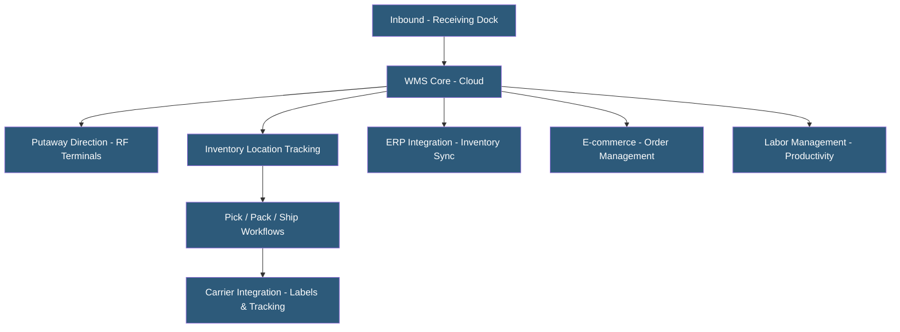

**Category:** Manufacturing & Supply Chain
**Difficulty:** Intermediate
**Reading time:** 6 min read

---

A Warehouse Management System (WMS) manages the physical operations within a warehouse or distribution center — receiving, putaway, picking, packing, and shipping — using real-time inventory tracking, directed workflows, and barcode or RFID scanning. Modern cloud WMS platforms improve labor productivity, space utilization, and order accuracy while integrating with ERP, TMS, and e-commerce systems for end-to-end fulfillment visibility.

- **Putaway Logic** — Rules directing where received goods should be stored (fixed locations, dynamic slotting, product family grouping)
- **Pick Strategy** — Method for fulfilling orders: single-order picking, batch picking, zone picking, or wave picking
- **Slotting Optimization** — Placing fast-moving products in ergonomically optimal pick locations to minimize travel time
- **License Plate Number (LPN)** — Barcode or RFID label on a pallet or container representing its contents in the WMS
- **Cross-Docking** — Receiving shipments and immediately routing them to outbound staging without putaway
- **Labor Management System (LMS)** — WMS module tracking engineered standards vs. actual worker productivity
- **Task Interleaving** — Combining putaway and replenishment tasks with pick tasks in a single travel path to improve efficiency
- **Carrier Integration** — WMS connection to shipping carriers for rate shopping, label printing, and shipment tracking

A WMS maintains a real-time inventory map of every storage location in the warehouse, tracking which products are stored where, in what quantity, and with what lot or serial attributes. Every physical movement — receiving, putaway, replenishment, picking, transfer — is recorded through barcode scans, RF terminal confirmations, or RFID reads.

When inventory is received, the WMS performs an ASN (Advance Ship Notice) match against expected purchase orders, confirms quantities, captures lot numbers or serial numbers, and directs workers to specific putaway locations based on configured slotting rules. Fast-moving A-class items are directed to ground-level golden zone locations minimizing travel; slow movers go to upper levels.

Order fulfillment uses wave management to group orders into discrete work batches released to the floor based on carrier cutoff times, order priority, and labor availability. Pick strategies vary by operation: single-order picking for high-mix operations, batch picking for e-commerce where multiple orders are picked simultaneously in a single warehouse tour, and zone picking for large warehouses where workers own defined areas.

Modern cloud WMS platforms (Manhattan Active WM, Blue Yonder WMS, SAP EWM, Oracle Warehouse Management, HighJump) run on multi-tenant or dedicated cloud infrastructure with RF terminal, voice picking, and mobile device support. APIs connect to e-commerce platforms for real-time order injection and shipment confirmation back to customers.

Labor management modules compare actual productivity to engineered time standards, calculating individual and team efficiency scores for performance management and staffing decisions.

- E-commerce fulfillment centers managing high-volume order picking with tight carrier cutoffs
- Food and beverage distributors tracking FEFO (first expired, first out) rotation for perishables
- Third-party logistics (3PL) providers managing multi-client warehouses with separate billing
- Manufacturing plants managing raw material, WIP, and finished goods locations
- Retailers managing multi-DC distribution with cross-docking and store replenishment

| Advantage | Disadvantage |
|-----------|--------------|
| Real-time inventory accuracy reduces shrinkage and mis-picks | Significant implementation cost and change management for workers |
| Directed workflows improve labor productivity by 20–40% | RF network infrastructure requires investment and maintenance |
| Lot/serial tracking enables targeted recall management | Integration complexity with ERP and carrier systems |
| Labor management enables data-driven staffing and coaching | Cloud-hosted WMS requires internet connectivity for shop floor operations |
| Carrier integration automates label printing and shipment tracking | Complex WMS configurations require specialized implementation expertise |

- [Supply Chain Management Platforms](supply-chain-management-platforms.md)
- [Inventory Optimization Platforms](inventory-optimization-platforms.md)
- [Transportation Management Systems](transportation-management-systems-tms.md)

---
*Part of the [Manufacturing & Supply Chain](index.md) category · [Back to Master Index](../../index.md)*
