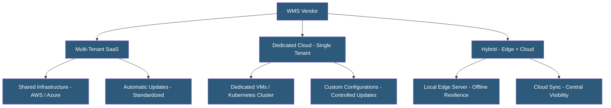

**Category:** Manufacturing & Supply Chain
**Difficulty:** Intermediate
**Reading time:** 5 min read

---

Cloud-hosted Warehouse Management Systems have displaced on-premises installations for most new deployments, offering lower upfront costs, faster implementation, and automatic updates. The provider landscape includes hyperscaler-backed offerings (AWS, Azure), specialized WMS vendors with proprietary cloud infrastructure, and SaaS-native startups targeting specific market segments. Choosing between multi-tenant SaaS, dedicated cloud, and private cloud deployments involves tradeoffs in customization, data isolation, and total cost.

- **Multi-tenant SaaS WMS** — Single application instance shared by multiple customers with logical data separation; lowest cost, standardized functionality
- **Dedicated Cloud WMS** — Single-tenant deployment on cloud infrastructure; more customization, higher cost
- **Edge Computing for WMS** — Local servers at the warehouse maintaining operations during internet outages, syncing to cloud when connectivity restores
- **WMS as a Service** — Fully managed WMS including software, infrastructure, and ongoing support from a single vendor
- **Hyperscaler Integration** — WMS deployments on AWS/Azure/GCP using managed database, compute, and networking services
- **Data Residency** — Regulatory requirement keeping inventory and operational data within specific geographic boundaries
- **API-First Architecture** — WMS exposed entirely through REST APIs enabling integration with any e-commerce, ERP, or carrier platform
- **Uptime SLA** — Contractual guarantee of WMS availability; 99.9% = 8.7 hours downtime/year; 99.99% = 52 minutes downtime/year

Multi-tenant SaaS WMS providers (Deposco, Extensiv, Logiwa, SKULabs) run a single application version serving all customers simultaneously. Customers share compute and database infrastructure with logical isolation enforced through tenant IDs. Updates roll out automatically on vendor schedules. This model suits high-growth e-commerce and 3PLs with standard workflows who value low operational overhead.

Dedicated cloud deployments provision separate application servers and databases per customer, hosted on the vendor's managed cloud infrastructure or a hyperscaler. SAP EWM on RISE, Blue Yonder WMS Cloud, and Manhattan Active WM fall in this category. Customers get more configuration latitude, controlled upgrade windows, and stronger data isolation at higher per-tenant cost.

Hybrid edge/cloud deployments address warehouse internet resilience concerns. An edge server at the facility handles all real-time RF terminal operations locally. When connectivity drops, operations continue uninterrupted. When connectivity restores, the edge server syncs transactions with the cloud platform. This architecture is particularly valuable for remote distribution centers or regions with unreliable connectivity.

API-first WMS platforms (Deposco, Logiwa) expose complete functionality through REST APIs, enabling deep integration with Shopify, Amazon, TikTok Shop, and dozens of carriers without custom development. Webhook support notifies downstream systems immediately when orders ship.

Security requirements include SOC 2 Type II certification, data encryption at rest and in transit, role-based access control, and warehouse-network segmentation to protect RF terminal traffic from broader internet exposure.

- E-commerce brands evaluating multi-tenant SaaS WMS for first fulfillment center deployment
- 3PLs needing multi-client, multi-warehouse management with billing integration
- Manufacturers adding cloud WMS to replace manual inventory tracking at distribution centers
- Companies with connectivity concerns requiring edge/cloud hybrid deployment
- Enterprises with data residency requirements selecting region-specific cloud hosting

| Advantage | Disadvantage |
|-----------|--------------|
| No server hardware procurement or data center management | Multi-tenant SaaS limits deep customization for complex operations |
| Automatic updates keep functionality and security current | Internet outages can impact operations without edge caching |
| API-first platforms enable rapid integration with modern channels | Data migration from legacy WMS requires significant effort |
| Usage-based scaling handles seasonal volume spikes | Monthly subscription costs accumulate over time vs. perpetual license |
| Global cloud availability enables multi-DC management from single platform | Vendor lock-in is significant with years of operational data stored |

- [Warehouse Management Systems](warehouse-management-systems-wms.md)
- [3PL Warehouse Management](3pl-warehouse-management.md)
- [Transportation Management Systems](transportation-management-systems-tms.md)

---
*Part of the [Manufacturing & Supply Chain](index.md) category · [Back to Master Index](../../index.md)*
