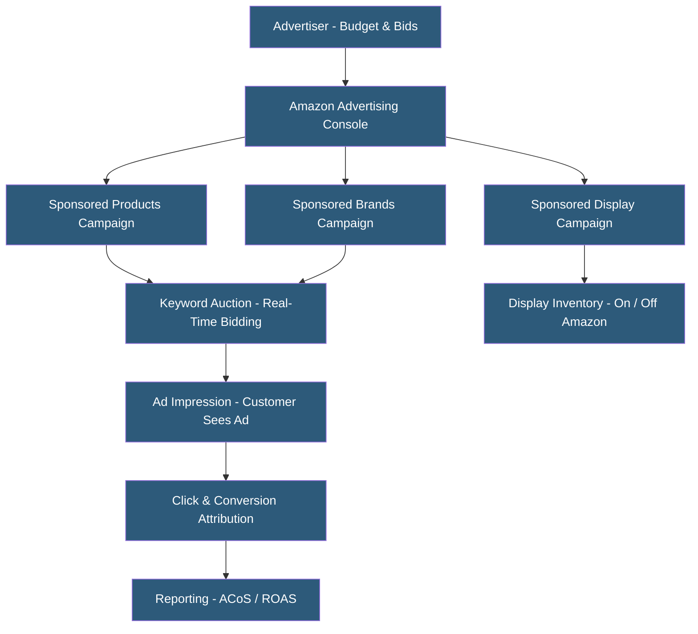

**Category:** Marketplace & Multi-vendor Platforms
**Difficulty:** Intermediate
**Reading time:** 6 min read

---

Amazon Advertising offers pay-per-click and display advertising products that drive visibility for products within Amazon's search results and product pages. It operates on a second-price auction model where advertisers bid on keywords and product targets. As organic ranking grows harder to achieve on competitive keywords, advertising spend has become effectively mandatory for most marketplace sellers, with ACoS (Advertising Cost of Sales) a critical profitability metric.

- **Sponsored Products** — PPC ads appearing in Amazon search results and on product detail pages, linked to specific ASINs
- **Sponsored Brands** — Banner ads appearing at the top of search results featuring a brand logo, custom headline, and multiple products
- **Sponsored Display** — Display advertising appearing on and off Amazon, including competitor product pages and external websites
- **ACoS (Advertising Cost of Sales)** — Ad spend divided by attributed sales; lower ACoS indicates more efficient advertising
- **TACoS (Total Advertising Cost of Sales)** — Ad spend divided by total sales (organic + paid); reflects advertising's true impact on business
- **Campaign Structure** — Organization of ads into campaigns > ad groups > keywords/targets with separate budgets and bid strategies
- **Bid Automation** — Amazon's dynamic bidding adjusting bids in real time based on conversion probability signals
- **ROAS (Return on Ad Spend)** — Revenue generated per dollar of ad spend; inverse of ACoS

Amazon Advertising uses a second-price auction: the highest bidder wins the ad placement but pays only one cent above the second-highest bid. Advertisers set maximum CPC bids for keywords or product targets. Amazon's algorithm also considers ad relevance (keyword match, click-through rate, conversion rate) when awarding placements — highly relevant ads can win positions against higher bidders.

Sponsored Products campaigns can be automatic (Amazon targets based on product information) or manual (advertiser specifies exact, phrase, or broad match keywords and product ASINs). Auto campaigns are typically used for discovery — finding converting search terms — which are then promoted to manual campaigns for bid control and budget allocation.

Campaign structure affects both management efficiency and performance. Tight ad groups with thematically related keywords enable more precise bid management. Negative keywords prevent ads from triggering on irrelevant searches consuming budget.

Amazon's attribution window (7-day click, 14-day view) determines which sales are credited to advertising. Sales from organic searches after an ad click within the attribution window are credited to the ad, making attribution additive with organic performance.

Amazon DSP (Demand-Side Platform) provides programmatic display and video advertising both on and off Amazon, targeting audiences based on Amazon's purchase and browsing data. DSP requires either a minimum spend commitment ($35K+) or management through an Amazon Advertising Agency.

Reporting provides keyword-level, product-level, and campaign-level performance data with a 48-hour data lag. Third-party tools (Perpetua, Pacvue, Intentwise) provide more sophisticated analytics and bid automation.

- New product launches requiring immediate visibility before organic ranking builds
- Established products defending keyword positions against competing ads
- Brands targeting competitor product pages with Sponsored Display
- Seasonal businesses ramping advertising during peak periods
- Sellers using advertising data to identify high-converting organic keyword opportunities

| Advantage | Disadvantage |
|-----------|--------------|
| Direct access to high-intent Amazon shoppers ready to purchase | Advertising costs have risen significantly as more sellers compete for placements |
| Auto campaigns efficiently discover converting search terms | Attribution complexity; it is difficult to separate advertising-driven from organic sales |
| Sponsored Brands improves brand visibility on branded and category keywords | Amazon receives advertising revenue regardless of ad effectiveness for the seller |
| Programmatic DSP enables off-Amazon retargeting of Amazon audiences | TACoS calculations require access to both advertising and total sales data |
| Advertising data informs organic listing and keyword optimization | Campaign management complexity scales with catalog size; automation tools add cost |

- [Amazon Seller Central](amazon-seller-central.md)
- [Amazon FBA (Fulfillment by Amazon)](amazon-fba-fulfillment-by-amazon.md)
- [Google Shopping Integration](google-shopping-integration.md)

---
*Part of the [Marketplace & Multi-vendor Platforms](index.md) category · [Back to Master Index](../../index.md)*
