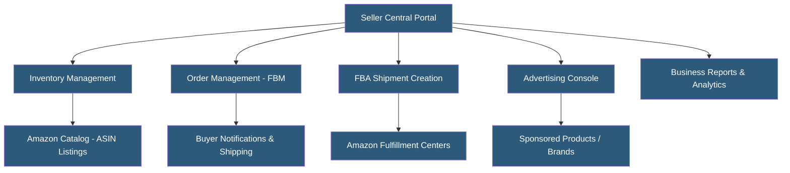

**Category:** Marketplace & Multi-vendor Platforms
**Difficulty:** Beginner
**Reading time:** 6 min read

---

Amazon Seller Central is the web portal through which third-party merchants list products, manage inventory, and fulfill orders on Amazon's marketplace. It is the primary interface for millions of sellers using both Fulfillment by Merchant (FBM) and Fulfillment by Amazon (FBA) programs. Seller Central provides advertising tools, performance analytics, brand registry access, and account health monitoring — all critical to marketplace visibility and seller status.

- **ASIN (Amazon Standard Identification Number)** — Amazon's unique 10-character product identifier; sellers attach offers to existing ASINs or create new ones
- **Buy Box** — Featured offer position on a product detail page; winning the Buy Box dramatically increases conversion rate
- **FBM (Fulfillment by Merchant)** — Seller handles all storage, picking, packing, and shipping of orders independently
- **Account Health** — Dashboard tracking seller performance metrics; failures can trigger listing suppression or account suspension
- **Seller Feedback** — Rating system where buyers evaluate seller service quality, separate from product reviews
- **Listing Optimization** — Improving product title, bullet points, description, and images to improve search ranking and conversion
- **A+ Content** — Enhanced product description format available to brand-registered sellers with richer layouts and images
- **Seller University** — Amazon's free training resource for new and existing sellers

Sellers access Seller Central via a web browser or through the Selling Partner API (SP-API), Amazon's REST API replacing the legacy MWS. Product listings are created by matching to existing ASINs in Amazon's catalog or submitting new catalog contributions for unique products. Listings require accurate product attributes, high-quality images meeting Amazon's technical specifications, and competitive pricing.

The Buy Box algorithm selects which seller's offer appears as the primary purchase option. Factors include competitive pricing, fulfillment method (FBA listings receive significant Buy Box preference), seller performance metrics, and inventory availability. Losing the Buy Box to competitors, including Amazon's own retail offers, is the primary revenue risk for marketplace sellers.

Performance metrics are continuously monitored against Amazon's seller standards: Order Defect Rate (ODR < 1%), Late Shipment Rate (< 4%), and Pre-fulfillment Cancellation Rate (< 2.5%). Violations trigger account health warnings, listing suppression, or account suspension. Account health monitoring requires proactive management — suspended accounts need formal appeal processes to reinstate.

The Seller Central API (SP-API) enables integration with inventory management software, repricing tools, and multichannel listing platforms. Sellers managing large catalogs (thousands of SKUs) use inventory files (flat file uploads) or API integrations to batch-update listings, prices, and quantities rather than manual entry.

Brand Registry access is available to sellers with registered trademarks, unlocking A+ Content, Brand Analytics, and enhanced counterfeit protection tools.

- Private label brands selling proprietary products exclusively on Amazon
- Resellers listing name-brand products alongside other marketplace sellers
- Small businesses starting e-commerce with Amazon as first sales channel
- Brands monitoring and controlling their product representations on Amazon
- Multichannel retailers adding Amazon as an additional revenue channel

| Advantage | Disadvantage |
|-----------|--------------|
| Access to Amazon's 300M+ customer base with high purchase intent | Referral fees (8–15%) and FBA fees reduce margins significantly |
| FBA provides Prime eligibility improving conversion and Buy Box performance | Account suspension risk from policy violations or complaints |
| Built-in advertising tools (Sponsored Products) drive traffic immediately | Limited customer relationship visibility; Amazon owns the customer relationship |
| Seller University and documentation resources reduce learning curve | Intense price competition on commoditized products compresses margins |
| Multichannel fulfillment enables using FBA inventory for other channels | Amazon's own retail presence creates direct competition on popular products |

- [Amazon FBA (Fulfillment by Amazon)](amazon-fba-fulfillment-by-amazon.md)
- [Amazon Advertising Platform](amazon-advertising-platform.md)
- [Multi-vendor Marketplace Platforms](multi-vendor-marketplace-platforms.md)

---
*Part of the [Marketplace & Multi-vendor Platforms](index.md) category · [Back to Master Index](../../index.md)*
