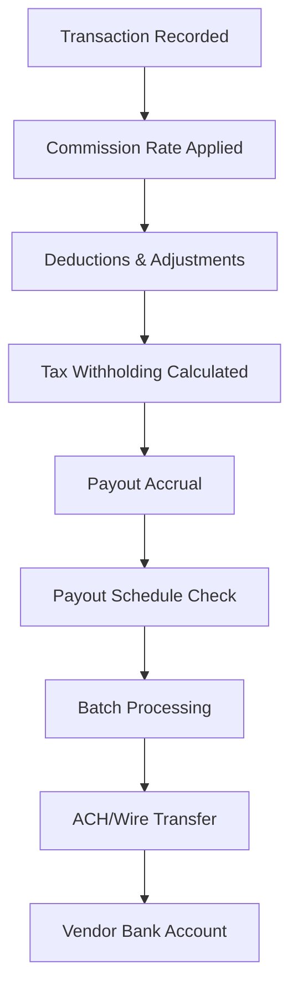

**Category:** Marketplace & Multi-vendor Platforms
**Difficulty:** Intermediate
**Reading time:** 6 min read

---

Commission management systems automate the calculation, tracking, and distribution of seller payouts based on sales transactions. These systems handle tiered commissions, incentive programs, adjustments, and integration with payment processing to ensure accurate, timely vendor compensation.

- **Commission Tiers** — Variable rates based on category, volume, or performance metrics
- **Payout Automation** — Scheduled bulk transfers to vendor bank accounts
- **Adjustment & Chargebacks** — Recalculating commissions when orders are returned or disputed
- **Tax Withholding** — Automated 1099 reporting and escrow for tax compliance
- **Real-time Tracking** — Dashboard visibility into earnings, deductions, and upcoming payouts

When a vendor makes a sale, the transaction value is captured with metadata including category, shipping, and platform fees. The commission rate is looked up based on vendor tier, product category, and any active promotions. After subtracting platform fees, payment processor charges, and chargebacks, the net commission is calculated. Tax withholding (typically 30% for Form 1099 filers) is reserved in escrow. Commissions accrue daily and are aggregated for scheduled payout runs (typically weekly or monthly). Batch processing consolidates all pending payouts and initiates ACH transfers or wire payments to verified bank accounts. The system maintains audit trails for reconciliation and tax reporting.

- Marketplace commission tracking for multi-vendor platforms
- Affiliate payment automation
- Franchise royalty distribution systems
- Revenue sharing between partners
- Influencer earnings & payout management
- Drop-shipping vendor settlements

| Advantage | Disadvantage |
|-----------|--------------|
| Eliminates manual payout calculations | Complex integrations with payment processors |
| Ensures compliance with 1099 tax requirements | Chargebacks & reversals complicate tracking |
| Real-time visibility improves vendor satisfaction | Foreign vendors face withholding complexity |
| Automated disputes reduce payment conflicts | Initial setup requires accounting expertise |
| Scales efficiently across thousands of vendors | Edge cases require manual intervention |

- [Vendor Onboarding Workflows](vendor-onboarding-workflows.md)
- [Payment Gateway Integration](../payment-processing/payment-gateway-integration.md)
- [Tax Compliance Automation](../tax-compliance/tax-compliance-automation.md)

---
*Part of the [Marketplace & Multi-vendor Platforms](index.md) category · [Back to Master Index](../../index.md)*
