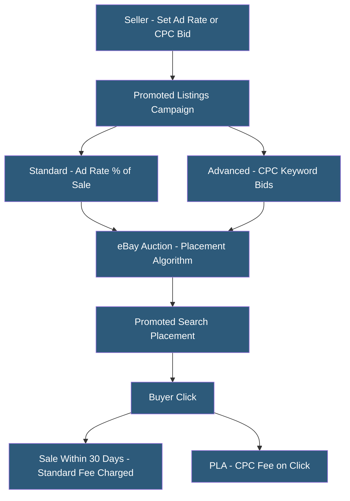

**Category:** Marketplace & Multi-vendor Platforms
**Difficulty:** Intermediate
**Reading time:** 5 min read

---

eBay Promoted Listings is eBay's native advertising system offering two main products: Promoted Listings Standard (cost-per-sale model) and Promoted Listings Advanced (cost-per-click with keyword bidding). Promoted Listings Standard is unique in charging sellers only when an ad leads to a sale within 30 days, making it lower risk than traditional PPC. Advanced allows more granular placement control through keyword-level bidding similar to Google Shopping.

- **Promoted Listings Standard (PLS)** — Ad rate paid as percentage of final sale price, charged only when a promoted listing results in a sale
- **Promoted Listings Advanced (PLA)** — CPC keyword-based campaign with daily budget caps and bid control
- **Ad Rate** — Percentage of sale price paid for PLS; eBay recommends category-specific rates; higher rates improve placement
- **30-Day Attribution Window** — PLS charges apply to sales within 30 days of a buyer clicking a promoted listing, even if they buy later organically
- **Trending Ad Rate** — eBay's suggested competitive ad rate for a product based on category performance data
- **Sponsored Placements** — Special ad positions including top-of-search, above organic results, and promoted slots within organic results
- **Campaign Analytics** — Metrics including impressions, clicks, sales, and effective ad rate for performance evaluation
- **Priority Campaign** — eBay's term for Promoted Listings Advanced campaigns using CPC bidding

Promoted Listings Standard uses a cost-per-sale model where sellers set an ad rate (e.g., 3% of the final sale price). eBay's algorithm considers the ad rate alongside listing quality signals to determine placement. Higher ad rates improve placement probability, but setting the rate too high erodes margins. eBay provides trending ad rates by category as benchmarks.

The 30-day attribution window means sellers pay the ad fee for any sale traced to a promoted listing click within 30 days, even if the buyer doesn't purchase immediately. This long window can inflate perceived advertising costs when organic demand is high — a buyer researching and returning to purchase days later still triggers the ad fee.

Promoted Listings Advanced operates as a traditional CPC campaign with keyword-level bids and daily budget caps. Sellers create keyword lists targeting specific search terms, set maximum CPC bids, and pay per click regardless of sale outcome. This model provides more control but requires active management to avoid wasted spend on non-converting keywords.

Offsite Ads (if opted in) extends Standard promotion to external partner sites and Google Shopping, increasing reach beyond eBay's marketplace at the same cost-per-sale pricing model.

Campaign management is accessible directly in Seller Hub or via API for bulk campaign operations. Third-party tools like Auctiva, Sellbrite, and ChannelAdvisor support Promoted Listings management within multichannel workflows.

- Sellers in competitive categories where organic visibility is low without promotion
- New listings needing initial sales velocity to build ranking signals
- Seasonal promotions during high-traffic periods (holidays, back-to-school)
- Sellers testing whether specific products generate buyer demand
- Large-catalog sellers using automated ad rate strategies to promote all listings

| Advantage | Disadvantage |
|-----------|--------------|
| Cost-per-sale model eliminates risk of paying for unproductive clicks | 30-day attribution window charges fees on sales that may have occurred organically |
| No minimum spend required; accessible to all seller tiers | Ad rate competition means effective rates rise as more sellers promote |
| Simple to activate; bulk enrollment available for entire inventory | Standard model provides less keyword-level control than platforms like Amazon |
| Advanced provides keyword targeting for specific search term placement | eBay's buyer intent signals less strong than Amazon's purchase-ready audience |
| Trending rate recommendations reduce manual research burden | Attribution reporting lacks granularity for sophisticated performance analysis |

- [eBay Seller Hub](ebay-seller-hub.md)
- [Amazon Advertising Platform](amazon-advertising-platform.md)
- [Google Shopping Integration](google-shopping-integration.md)

---
*Part of the [Marketplace & Multi-vendor Platforms](index.md) category · [Back to Master Index](../../index.md)*
