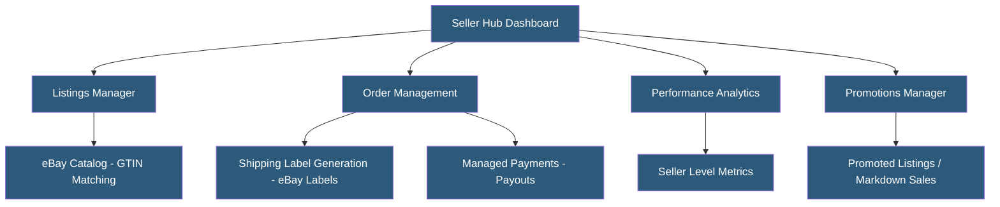

**Category:** Marketplace & Multi-vendor Platforms
**Difficulty:** Beginner
**Reading time:** 5 min read

---

eBay Seller Hub is the centralized dashboard for eBay sellers managing listings, orders, inventory, promotions, and performance analytics. eBay supports both fixed-price and auction-format listings, serving a broad mix of individual sellers, small businesses, and large enterprise retailers. The platform's marketplace model lets sellers maintain their own brand identity and pricing more freely than Amazon, though the customer base is significantly smaller.

- **Fixed Price Listing** — Product listed at a set Buy It Now price; standard format for business sellers
- **Auction Listing** — Time-limited bidding format; best for collectibles, rare items, and estate sales
- **eBay Store** — Subscription tier providing reduced listing fees, custom storefront, and marketing tools
- **Top Rated Seller (TRS)** — Status earned by meeting high performance thresholds; provides fee discounts and search boost
- **Promoted Listings** — eBay's PPC advertising product charging a percentage of sale price only when the sale occurs
- **Managed Payments** — eBay's integrated payment processing replacing PayPal; funds deposited directly to seller bank accounts
- **Seller Performance Standard** — Metrics including late shipment rate, defect rate, and cases closed without seller resolution
- **Item Specifics** — Structured product attributes (brand, color, size, material) improving search relevance and catalog quality

eBay Seller Hub provides a unified interface for all selling activities. Listings are created by matching products to eBay's catalog using GTIN (barcode) data when available, or by creating custom listings with manual attribute entry. Item Specifics — structured attributes like brand, condition, and product specifications — are required for most categories and directly impact search ranking within eBay's Cassini search algorithm.

eBay Managed Payments handles all payment processing since the migration from PayPal. Buyers pay through eBay checkout using credit cards, debit cards, Apple Pay, or PayPal. Sellers receive payouts directly to linked bank accounts, typically within 2 business days of order delivery.

Promoted Listings Standard charges an ad rate (percentage of sale price, typically 2–12%) only when a sale occurs from a promoted listing — no charge for impressions or clicks that don't convert. Promoted Listings Advanced introduces CPC bidding for higher placement control.

eBay's API (Trading API, Inventory API, Fulfillment API) enables bulk listing management and order processing integration with e-commerce platforms and multichannel management tools like Linnworks, Sellbrite, and ChannelAdvisor.

Seller performance is evaluated against eBay's performance standards. Below-standard performance reduces search visibility and may result in listing removal. Top Rated Seller status requires 100+ transactions per year, 98%+ positive feedback, and metrics below defined thresholds.

- Sellers of unique, vintage, or collectible items benefiting from auction format
- B2B equipment and parts sellers reaching buyers eBay's industrial category attracts
- Liquidators and discount retailers selling overstock in volume
- Automotive parts sellers leveraging eBay Motors' large enthusiast buyer base
- Small businesses diversifying sales channels beyond Amazon

| Advantage | Disadvantage |
|-----------|--------------|
| Auction format can generate premium prices for unique items | Smaller overall buyer pool compared to Amazon for commodity products |
| More pricing control and brand identity than Amazon's 1P model | Buyer trust more variable; high rate of low-value disputes in some categories |
| Promoted Listings only charges on successful sales | Listing fees and final value fees accumulate; eBay Store subscription required for large catalogs |
| Strong categories for motors, collectibles, and industrial equipment | Search algorithm less transparent; listing optimization more complex |
| Free shipping expectations from buyers can erode margins | Returns process less automated than Amazon FBA |

- [eBay Promoted Listings](ebay-promoted-listings.md)
- [Amazon Seller Central](amazon-seller-central.md)
- [Multi-vendor Marketplace Platforms](multi-vendor-marketplace-platforms.md)

---
*Part of the [Marketplace & Multi-vendor Platforms](index.md) category · [Back to Master Index](../../index.md)*
