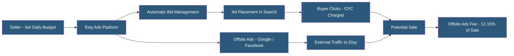

**Category:** Marketplace & Multi-vendor Platforms
**Difficulty:** Beginner
**Reading time:** 5 min read

---

Etsy Ads is Etsy's internal CPC advertising system promoting listings within Etsy search results and category pages. Sellers set a daily budget and Etsy automatically manages bids and placement based on listing relevance and predicted conversion rates. Etsy Ads differs from most marketplace advertising in its simplicity — there's no keyword research, bid management, or campaign structure; sellers simply enable ads and set a budget.

- **Daily Budget** — Maximum amount a seller is willing to spend on Etsy Ads per day; actual spend adjusts based on available inventory and demand
- **Promoted Listing** — A listing enrolled in Etsy Ads showing in sponsored positions within Etsy search
- **Offsite Ads** — Separate program placing Etsy listings on Google, Facebook, Instagram, and Bing; fee charged only on sales
- **CPC (Cost Per Click)** — Amount paid each time a buyer clicks an Etsy Ad; Etsy manages individual bids automatically
- **Listing Score** — Etsy's internal quality signal influencing both organic ranking and ad placement efficiency
- **Ad Spend Report** — Analytics showing spend, clicks, orders, and revenue per promoted listing
- **Minimum Daily Budget** — $1.00 minimum daily spend for Etsy Ads
- **Offsite Ads Fee** — 15% of sale price for sellers with less than $10K annual revenue; 12% for sellers above that threshold

Etsy Ads operates on a simplified CPC model that removes the keyword research and bid management burden from sellers. When a seller enrolls listings in Etsy Ads and sets a daily budget, Etsy's algorithm automatically determines which searches to enter, what to bid, and which listings to show. The platform prioritizes ads for listings that have strong organic conversion signals — well-tagged, attractively priced listings with good photos perform better in ads too.

Budget allocation is automatic across all promoted listings. Etsy distributes spend toward listings most likely to convert based on real-time signals. Sellers cannot manually allocate specific budgets per listing or set maximum CPCs — the system handles this entirely.

Offsite Ads is a separate but related program. Etsy actively promotes seller listings on Google Shopping, Facebook, Instagram, Bing, and Pinterest at Etsy's expense. If a sale results from an offsite ad within 30 days, Etsy charges the seller a fee (15% for smaller sellers, 12% for those over $10K annual revenue). Sellers with under $10K annual revenue can opt out; those above must participate.

The Ads Dashboard in Shop Manager provides reports showing spend, clicks, orders, and revenue for each promoted listing. This data helps identify which listings generate positive ROI from advertising and which consume budget without converting.

Etsy Ads works best as a complement to strong organic performance rather than a substitute for listing quality. Ads amplify well-performing listings — they rarely rescue listings that don't convert organically.

- Etsy sellers wanting to boost visibility for seasonal items during peak shopping periods
- New shops building initial sales velocity to improve organic ranking
- Sellers testing new product lines to quickly gauge market demand
- Shops with strong organic performers wanting incremental reach from a simple advertising solution
- Sellers evaluating whether advertising spend improves overall revenue meaningfully

| Advantage | Disadvantage |
|-----------|--------------|
| Extremely simple setup; no keyword research or bid management required | Limited control over where budget is allocated or which searches trigger ads |
| Low minimum budget ($1/day) accessible to new and small sellers | Offsite Ads fee (12–15%) is mandatory for high-revenue sellers regardless of ROI |
| Offsite Ads drives external traffic at no upfront cost | Reporting granularity insufficient for sophisticated advertising optimization |
| Algorithm prioritizes strong listings, reinforcing organic quality signals | Sellers cannot prevent ads from running on low-value search terms |
| Refunds for clicks Etsy determines were fraudulent or low-quality | New sellers may see poor initial performance before listing quality signals build |

- [Etsy Seller Dashboard](etsy-seller-dashboard.md)
- [Amazon Advertising Platform](amazon-advertising-platform.md)
- [Google Shopping Integration](google-shopping-integration.md)

---
*Part of the [Marketplace & Multi-vendor Platforms](index.md) category · [Back to Master Index](../../index.md)*
