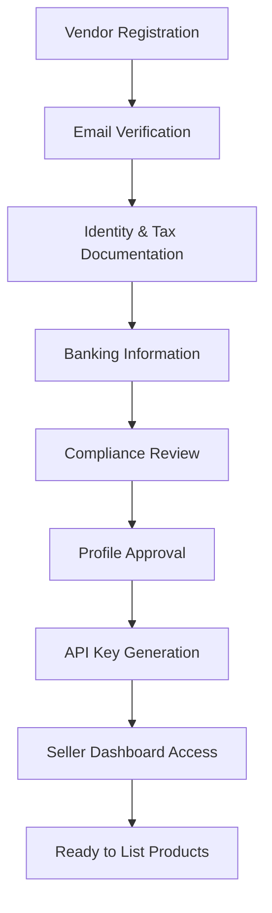

**Category:** Marketplace & Multi-vendor Platforms
**Difficulty:** Intermediate
**Reading time:** 6 min read

---

Vendor onboarding workflows are systematic processes that guide new sellers through account creation, verification, profile setup, and operational readiness. These workflows ensure compliance, quality standards, and smooth integration into the marketplace ecosystem while minimizing friction and abandonment rates.

- **Verification & KYC** — Know Your Customer checks to prevent fraud and ensure legitimacy
- **Tiered Onboarding** — Different pathways based on vendor type (individual, business, enterprise)
- **Document Management** — Collecting and validating identity, tax, banking, and business licenses
- **Integration APIs** — Connecting vendor systems to catalog, shipping, and payment platforms
- **Compliance Checks** — Regulatory validation, sanctions screening, and seller agreement acceptance

Vendor onboarding begins with registration, where applicants provide basic contact and business details. Email verification confirms communication capability. The workflow then branches into document collection: identity verification (government IDs, business licenses), tax information (W9/1099 forms), and banking details for payout setup. Automated systems screen for sanctions lists and regulatory flags while compliance teams review documentation. Once approved, vendors receive API credentials and portal access to begin managing inventory, orders, and fulfillment. Progressive profiling continues as vendors unlock higher transaction limits or access new marketplaces based on performance history.

- New seller onboarding in e-commerce marketplaces
- Enterprise vendor registration for B2B platforms
- Franchise partner integration into multi-location networks
- Third-party seller programs on retail platforms
- Service provider vetting for gig economy platforms
- Supply chain vendor management systems

| Advantage | Disadvantage |
|-----------|--------------|
| Reduces fraud & chargebacks through verification | Slows time-to-market for legitimate vendors |
| Ensures regulatory compliance & legal protection | Requires significant backend infrastructure |
| Standardizes vendor quality across platform | Creates barrier to entry for small sellers |
| Enables progressive profiling & trust scoring | Operational overhead for documentation review |
| Improves user experience through clear workflows | Higher abandonment rates if process too complex |

- [Commission Management Systems](commission-management-systems.md)
- [Marketplace Payment Processing](../payment-processing/marketplace-payment-processing.md)
- [Vendor Performance Analytics](../analytics/vendor-performance-analytics.md)

---
*Part of the [Marketplace & Multi-vendor Platforms](index.md) category · [Back to Master Index](../../index.md)*
