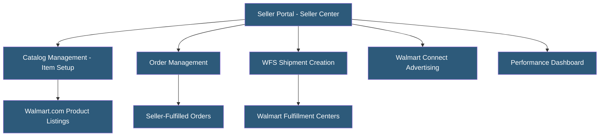

**Category:** Marketplace & Multi-vendor Platforms
**Difficulty:** Intermediate
**Reading time:** 6 min read

---

Walmart Marketplace is a curated third-party seller program on Walmart.com, requiring application and approval unlike Amazon's open enrollment. Walmart's marketplace is the second-largest US online marketplace by traffic, offering significant reach with generally less seller competition than Amazon. Approved sellers gain access to Walmart's customer base, fulfillment infrastructure (Walmart Fulfillment Services), and advertising platform.

- **Seller Application** — Required onboarding process with Walmart reviewing business credentials, product quality, and fulfillment capabilities
- **Item Setup** — Process of creating product catalog entries on Walmart.com with required attributes and compliance specifications
- **WFS (Walmart Fulfillment Services)** — Walmart's FBA equivalent; sellers ship inventory to Walmart fulfillment centers for pickup and delivery
- **Pro Seller Badge** — Trust indicator awarded to high-performing sellers with excellent metrics; improves search ranking
- **Walmart Connect** — Advertising platform for Sponsored Search (keyword) and Sponsored Products (product-level) ads
- **Buy Box** — Walmart's featured offer position; won through pricing, performance metrics, and fulfillment speed
- **Site Categorization** — Walmart's taxonomy system; correct category assignment is critical for search relevance
- **Return Policy Compliance** — Walmart requires sellers to accept returns within Walmart's standard policy windows

Walmart Marketplace requires a business application and review process. Applicants must demonstrate business legitimacy (US business entity, tax ID), product safety compliance (applicable certifications), and fulfillment capability. Walmart targets established sellers with proven track records rather than new marketplace entrants.

Item setup requires populating Walmart's item specification sheets with extensive product attributes. Walmart maintains a strict taxonomy; items must be categorized correctly or they will be removed. Content quality requirements include multiple images on white backgrounds, detailed descriptions, and required safety attributes.

Seller-fulfilled orders require 1-3 day shipping with tracking upload within 24 hours. Walmart's seller metrics include on-time shipping rate, delivery defect rate, and cancelation rate — falling below thresholds results in search demotion and potential account suspension.

WFS mirrors Amazon FBA: sellers send inventory to Walmart's fulfillment centers and Walmart handles pick, pack, ship, and returns. WFS listings receive 2-day delivery tags improving conversion, and WFS sellers are prioritized in Buy Box selection. WFS fees are competitive with Amazon FBA and sometimes lower depending on product category.

Walmart Connect advertising operates similarly to Amazon Sponsored Products — keyword-based CPC bidding for Sponsored Search and product-level Sponsored Products. Walmart's advertising costs are generally lower than Amazon's due to less advertiser competition, though the buyer audience is correspondingly smaller.

- Established Amazon sellers diversifying to reduce Amazon dependency
- Consumer goods brands wanting omnichannel retail presence including Walmart.com
- Sellers with products aligned to Walmart's value-oriented customer demographics
- Brands wanting less competition than Amazon for similar product categories
- WFS users wanting fast delivery tags without Amazon's logistics infrastructure

| Advantage | Disadvantage |
|-----------|--------------|
| Less advertiser and seller competition than Amazon for many categories | Smaller buyer pool than Amazon; lower overall sales volume potential |
| WFS provides 2-day delivery tags comparable to Amazon Prime | Application and item setup process is more complex than Amazon's open marketplace |
| Generally lower advertising CPCs than Amazon Sponsored Products | Walmart's item taxonomy rigidity creates frequent listing issues |
| Pro Seller Badge rewards high-performing sellers with search advantages | Walmart's Buy Box algorithm can be opaque; pricing pressure is significant |
| Growing marketplace with investment in third-party seller capabilities | Commission fees vary by category; some categories have higher rates than Amazon |

- [Walmart Fulfillment Services](walmart-fulfillment-services-wfs.md)
- [Amazon Seller Central](amazon-seller-central.md)
- [Multi-vendor Marketplace Platforms](multi-vendor-marketplace-platforms.md)

---
*Part of the [Marketplace & Multi-vendor Platforms](index.md) category · [Back to Master Index](../../index.md)*
