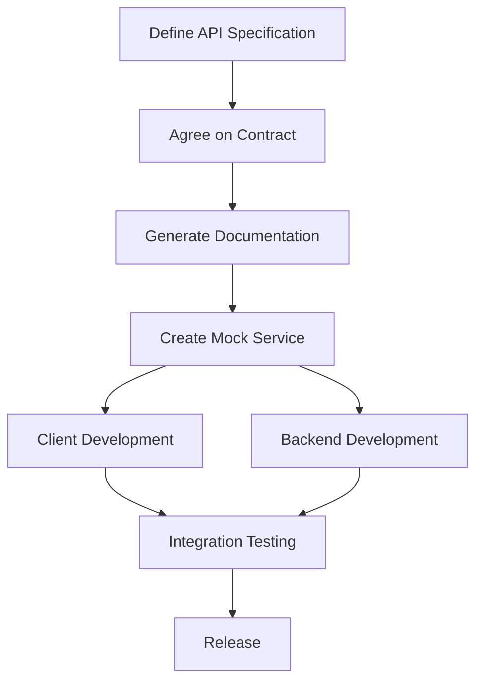

**Category:** Microservices Architecture
**Difficulty:** Intermediate
**Reading time:** 6 min read

---

API-first development is a design approach where APIs are designed and agreed upon before implementation begins. Rather than implementing services and creating APIs as an afterthought, teams define clear API contracts upfront, enabling parallel development and integration testing. This approach is essential for microservices where multiple teams need clear, stable interfaces to work independently and efficiently.

- **API Contract** — Explicit specification of API behavior and data format
- **API Design First** — Designing APIs before implementation
- **API Specification** — Documents like OpenAPI/Swagger defining API details
- **Mock Services** — Stub implementations allowing client testing without backends
- **API Versioning** — Managing API changes without breaking clients

API-first development begins with teams collaboratively designing the API specification using tools like OpenAPI (Swagger) or GraphQL Schema. This specification defines endpoints, request/response formats, error codes, and behavior comprehensively. Once agreed, the specification can generate documentation, mock servers, and client libraries automatically. This enables client teams to begin development immediately using mock services while backend teams implement real functionality. Mock servers provide realistic responses for testing without requiring the actual backend. API specifications also serve as contracts for testing and validation. When implementation is complete, integration happens smoothly since both sides worked against the same contract. This approach catches design issues early, reduces integration surprises, and enables true parallel development. It also creates clear communication between teams and reduces misunderstandings about API behavior.

- Enabling parallel development across multiple teams
- Reducing integration time and issues
- Improving API design quality through early feedback
- Creating clear contracts between services
- Generating documentation and client code automatically
- Testing without backend services

| Advantage | Disadvantage |
|-----------|--------------|
| Parallel development possible | Requires upfront design effort |
| Clear API contracts reduce surprises | May miss practical implementation concerns |
| Automated documentation generation | Design changes require renegotiation |
| Early problem detection | Learning curve for API-first tools |
| Improves API design quality | Can slow initial development start |

- [RESTful API design](restful-api-design.md)
- [GraphQL API architecture](graphql-api-architecture.md)
- [API versioning strategies](api-versioning-strategies.md)

---
*Part of the [Microservices Architecture](index.md) category · [Back to Master Index](../../index.md)*
