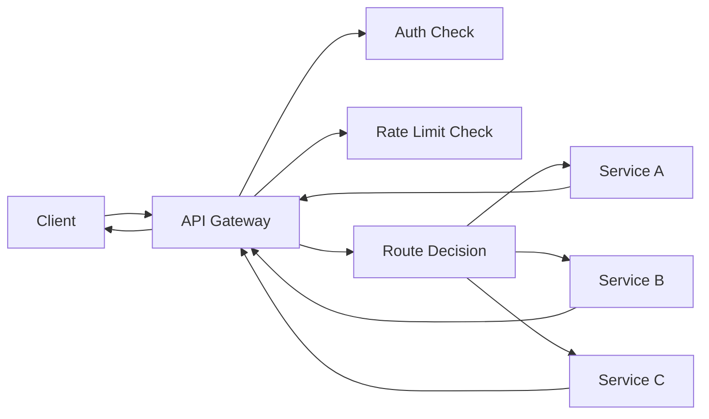

**Category:** Microservices Architecture
**Difficulty:** Intermediate
**Reading time:** 6 min read

---

API gateways serve as single entry points for client requests to microservices, providing request routing, authentication, rate limiting, and response transformation. Gateways simplify client interactions by hiding service complexity and providing cross-cutting concerns. Different patterns (simple gateway, backend for frontend) solve different architectural challenges in microservices systems.

- **API Gateway** — Central router for all client requests
- **Request Routing** — Directing requests to appropriate services
- **Rate Limiting** — Controlling request volume to prevent abuse
- **Authentication** — Centralized login and token validation
- **Response Transformation** — Converting service responses for clients

API gateways sit between clients and microservices, handling several responsibilities. Incoming requests are authenticated and checked against rate limits. Once validated, requests are routed to appropriate services based on path patterns or other rules. Gateways can aggregate responses from multiple services, transform data formats, or cache responses. They provide a single point for implementing cross-cutting concerns (authentication, logging, metrics) without duplicating code in services. Gateways also decouple clients from service locations and versions, enabling service refactoring without breaking clients. Well-designed gateways are stateless and horizontally scalable. They should be monitored closely as they're critical infrastructure. Some gateways also provide features like API versioning management, request validation against schemas, and service discovery integration.

- Single entry point for multiple client types (web, mobile)
- Implementing centralized authentication and authorization
- Rate limiting to protect services from overload
- API version management and backward compatibility
- Response aggregation across multiple services
- Reducing client implementation complexity

| Advantage | Disadvantage |
|-----------|--------------|
| Centralized cross-cutting concerns | Single point of failure if not redundant |
| Decouples clients from services | Operational complexity and monitoring |
| Simplified client implementation | Potential performance bottleneck |
| Easy API versioning and management | Adds latency to requests |
| Improved security through centralization | Configuration complexity |

- [Backend for Frontend (BFF) pattern](backend-for-frontend-bff-pattern.md)
- [Service mesh benefits](service-mesh-benefits.md)
- [Microservices design principles](microservices-design-principles.md)

---
*Part of the [Microservices Architecture](index.md) category · [Back to Master Index](../../index.md)*
