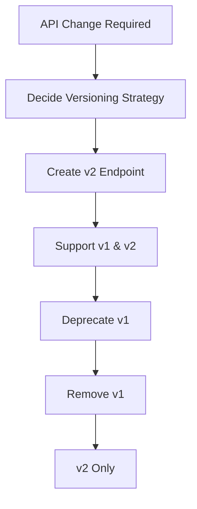

**Category:** Microservices Architecture
**Difficulty:** Intermediate
**Reading time:** 6 min read

---

API versioning manages changes to APIs while maintaining compatibility with existing clients. Multiple strategies exist for versioning—URL path, query parameter, header-based, or content negotiation—each with different trade-offs. Choosing the right versioning strategy balances backward compatibility, clarity, and operational overhead.

- **Semantic Versioning** — Version format MAJOR.MINOR.PATCH indicating change type
- **URL Path Versioning** — Version number in URI path (/v1/customers)
- **Query Parameter Versioning** — Version specified in query string (?version=1)
- **Header Versioning** — Version in HTTP headers (Accept-Version)
- **Backward Compatibility** — Supporting old and new versions simultaneously

API versioning begins when changes are needed that would break existing clients. Major changes (removing fields, changing types) require new versions. URL path versioning creates distinct endpoints (/v1/resource, /v2/resource) making versions obvious but adding operational complexity. Query parameter versioning (?version=2) keeps URLs cleaner but is less visible. Header versioning (Accept-Version: 2) is clean but easily missed. Content negotiation allows one URL to serve multiple versions based on Accept headers. The deprecation process is critical: old versions must be supported long enough for clients to migrate. Clear communication about timeline and migration requirements is essential. Some organizations support only the latest and previous version, while others maintain longer support windows. Minimizing versions through careful design (additive changes, default values) reduces operational complexity. Proper versioning strategy enables evolution without breaking client integrations.

- Managing backward compatibility as APIs evolve
- Supporting multiple client versions simultaneously
- Maintaining public APIs used by external partners
- Coordinating changes across multiple teams
- Deprecating problematic API designs
- Supporting legacy clients during migration

| Advantage | Disadvantage |
|-----------|--------------|
| Backward compatibility possible | Operational complexity increases |
| Clear migration path | Code duplication across versions |
| Prevents breaking changes | Performance overhead supporting multiples |
| Version identities are explicit | Harder to maintain consistency |
| Supports legacy clients | Complicates API evolution |

- [RESTful API design](restful-api-design.md)
- [API gateway patterns](api-gateway-patterns.md)
- [API-first development](api-first-development.md)

---
*Part of the [Microservices Architecture](index.md) category · [Back to Master Index](../../index.md)*
