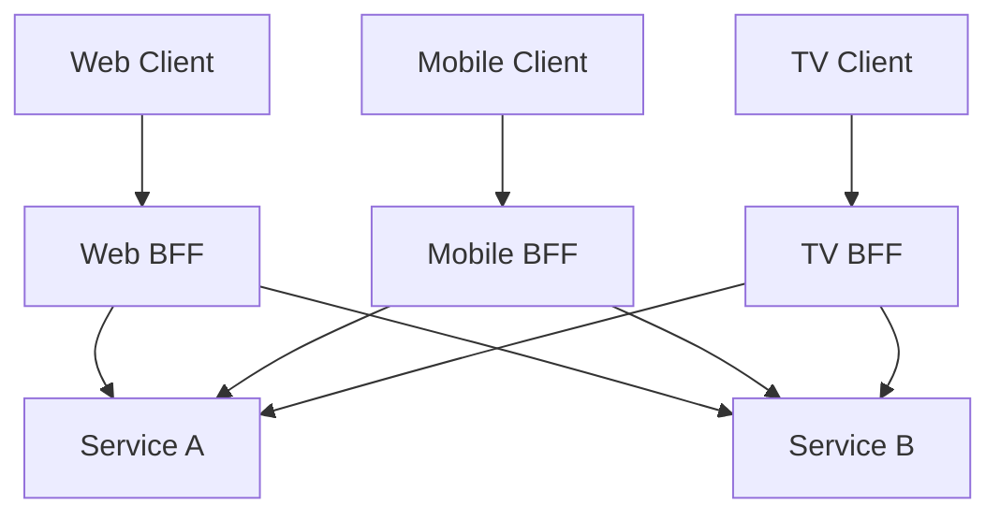

**Category:** Microservices Architecture
**Difficulty:** Intermediate
**Reading time:** 6 min read

---

The Backend for Frontend (BFF) pattern creates specialized backends for each client type (web, mobile, TV) rather than forcing all clients to consume a single generic API. Each BFF understands its client's specific needs, optimizing data format, caching, and network efficiency. This pattern enables better user experiences and development velocity while keeping core microservices independent of client requirements.

- **BFF (Backend for Frontend)** — Dedicated backend for specific client type
- **Client-Specific Optimization** — API tailored to client performance and needs
- **Service Aggregation** — BFF calls multiple services for client requests
- **Data Transformation** — Reformatting data for specific client consumption
- **API Consistency** — BFFs maintain contract consistency despite aggregation

Instead of forcing all clients to use a generic API, each client type gets a specialized BFF. The web BFF might return full HTML with server-side rendering, while the mobile BFF returns JSON optimized for bandwidth and battery consumption. The TV BFF might return paginated results with lower frame rates. Each BFF understands its client's capabilities and constraints. BFFs call core microservices to fulfill requests, aggregating and transforming responses. This aggregation hides service complexity from clients and enables services to evolve independently. Each BFF is independently deployable, allowing rapid iteration on client-specific optimization without affecting other clients. BFFs are typically small, focused services without complex business logic—they're orchestration and adaptation layers. This pattern works particularly well when client types have significantly different needs. If clients have similar needs, a single gateway might suffice.

- Supporting web, mobile, and TV clients with different needs
- Optimizing bandwidth usage for mobile clients
- Implementing different caching strategies per client
- Adapting to different screen sizes and capabilities
- Improving time-to-interactive for specific clients
- Enabling independent evolution of clients

| Advantage | Disadvantage |
|-----------|--------------|
| Client-specific optimization possible | More code to maintain |
| Services isolated from client needs | Potential code duplication |
| Independent evolution per client | Harder to maintain consistency |
| Better user experience per platform | Operational complexity |
| Faster development for new clients | Requires deeper architecture understanding |

- [API gateway patterns](api-gateway-patterns.md)
- [API-first development](api-first-development.md)
- [Service decomposition strategies](service-decomposition-strategies.md)

---
*Part of the [Microservices Architecture](index.md) category · [Back to Master Index](../../index.md)*
