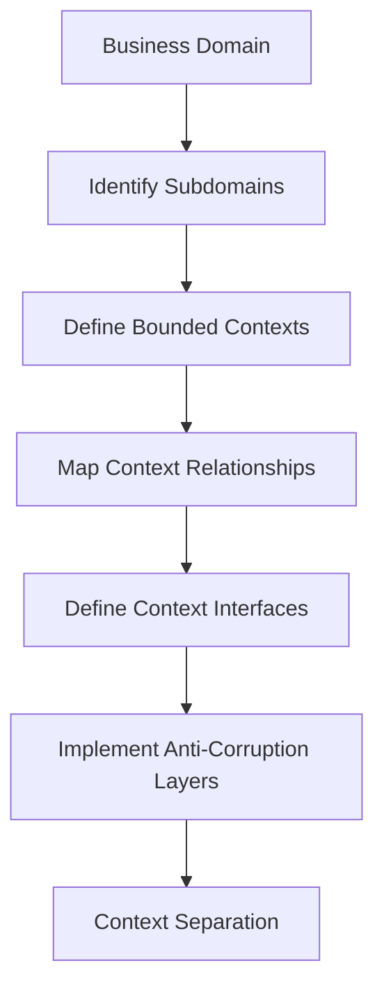

**Category:** Microservices Architecture
**Difficulty:** Intermediate
**Reading time:** 6 min read

---

Bounded contexts are explicit boundaries within a domain where a specific model applies and is consistent. Identifying bounded contexts is crucial for microservices architecture as each context often becomes a service boundary. Clear context boundaries prevent model pollution, enable independent evolution, and ensure services reflect actual business domains rather than technical conveniences.

- **Bounded Context** — Boundary where a domain model is valid and consistent
- **Context Mapping** — Relationships between bounded contexts
- **Shared Kernel** — Minimal model shared between contexts
- **Anti-Corruption Layer** — Translation layer between contexts with different models
- **Context Isolation** — Complete model separation preventing leakage between contexts

Bounded contexts emerge from understanding where business language and models change. Within an e-commerce system, the "Customer" concept differs significantly between Sales and Support contexts. Identifying contexts involves mapping where terminology shifts, where models diverge, or where organizational boundaries exist. Once contexts are identified, their relationships must be defined using context mapping patterns. Shared Kernel involves minimal shared code between contexts—usually value objects. Anti-Corruption Layers translate between different models when contexts interact. This prevents one context's model from contaminating another. Bounded contexts become clear service boundaries in microservices, with explicit APIs defining how they communicate. This boundary maintenance is crucial; allowing models to leak between contexts creates tight coupling and makes services harder to change.

- Designing microservice boundaries aligned with business domains
- Understanding how different teams and departments interact
- Planning integration between legacy and new systems
- Identifying team responsibility and code ownership
- Planning migration from monoliths to microservices
- Reducing model conflicts in large systems

| Advantage | Disadvantage |
|-----------|--------------|
| Prevents model pollution | Requires clear business understanding |
| Enables independent evolution | May require translation layers |
| Clear ownership and responsibility | More complex inter-service communication |
| Reduces team coordination needs | Overhead of maintaining boundaries |
| Easier to test and maintain | Can lead to service proliferation |

- [Domain-Driven Design (DDD)](domain-driven-design-ddd.md)
- [Service decomposition strategies](service-decomposition-strategies.md)
- [API gateway patterns](api-gateway-patterns.md)

---
*Part of the [Microservices Architecture](index.md) category · [Back to Master Index](../../index.md)*
