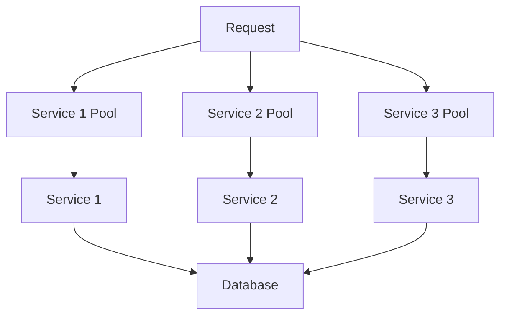

**Category:** Microservices Architecture
**Difficulty:** Intermediate
**Reading time:** 6 min read

---

The bulkhead pattern isolates resources to prevent failures in one area from affecting others. Like compartments in a ship's hull, bulkheads partition thread pools, memory, and connections, ensuring partial failures remain isolated. This pattern is essential for microservices where one slow service shouldn't starve others of resources or cause system-wide outages.

- **Bulkhead** — Isolated resource partition
- **Thread Pool** — Separate threads per service dependency
- **Semaphore** — Limiting concurrent requests
- **Resource Isolation** — Preventing resource starvation
- **Failure Domain** — Scope of impact from failures

Bulkheads isolate resources—typically thread pools or connection pools—for each external dependency. When calling Service 1, requests use Service 1's dedicated thread pool. If Service 1 becomes slow, its thread pool fills up but doesn't affect other services using different pools. Once a pool is exhausted, new requests to that service fail fast instead of queuing. This prevents one slow service from consuming all threads and making everything slow. Semaphores limit concurrent requests to each service. Connection pools isolate database connections per service. Memory can be isolated through separate JVM processes. The key is defining failure domains appropriately—too many compartments add complexity, while too few reduce isolation benefits. Bulkheads work best combined with circuit breakers—once a pool exhausts, the circuit breaker detects failures and stops sending requests. This prevents unnecessary waiting. Proper sizing of bulkheads is important; too small and legitimate traffic is rejected, too large and isolation benefits disappear.

- Preventing resource starvation across services
- Isolating effects of slow or failing services
- Protecting critical services from impacts of others
- Enabling graceful degradation under load
- Ensuring important requests aren't queued behind others
- Improving system stability and predictability

| Advantage | Disadvantage |
|-----------|--------------|
| Prevents cascading failures | Reduces overall throughput |
| Isolates slow service impacts | Requires careful sizing |
| Enables fast failure | Adds complexity |
| Improves predictability | Resource overhead |
| Works at application level | Requires code changes |

- [Circuit breaker pattern](circuit-breaker-pattern.md)
- [Retry and timeout strategies](retry-and-timeout-strategies.md)
- [Service mesh benefits](service-mesh-benefits.md)

---
*Part of the [Microservices Architecture](index.md) category · [Back to Master Index](../../index.md)*
