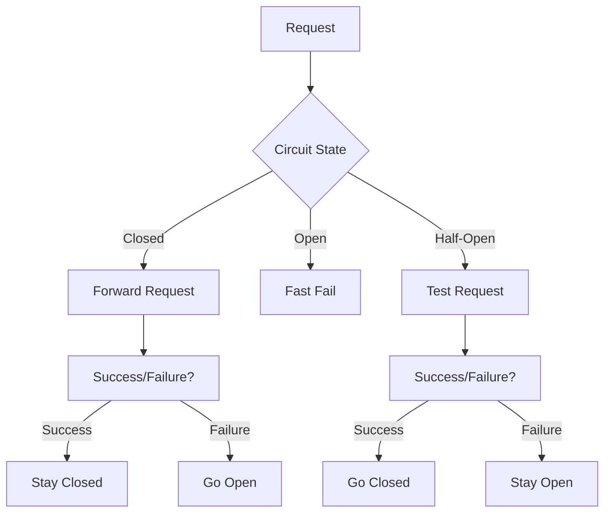

**Category:** Microservices Architecture
**Difficulty:** Intermediate
**Reading time:** 6 min read

---

The circuit breaker pattern prevents cascading failures in microservices by stopping requests to failing services. When a service experiences errors, the circuit breaker trips, fast-failing subsequent requests without waiting for timeouts. After a timeout period, the breaker attempts recovery by allowing test requests. This pattern protects system stability during partial outages.

- **Closed State** — Normal operation, requests pass through
- **Open State** — Service failing, requests rejected immediately
- **Half-Open State** — Testing if service has recovered
- **Failure Threshold** — Error rate triggering state change
- **Timeout** — Duration before attempting recovery

Breakers monitor request success rates to downstream services. In closed state, requests pass through normally. When error rate exceeds threshold, the breaker opens, immediately failing subsequent requests. This fast-fail prevents wasting resources on doomed requests and reduces load on the failing service. After a timeout period, the breaker enters half-open state, allowing a limited number of test requests. If these succeed, the breaker closes. If they fail, it reopens and tries again later. This exponential backoff prevents hammering recovering services. Breakers can fail requests immediately or return cached responses. Some implementations support different thresholds for different failure types. Breakers work best combined with retry logic—retries on the breaker help with transient failures, while breakers prevent retry amplification. Proper configuration is critical; thresholds too sensitive cause unnecessary outages, while thresholds too high delay detection.

- Preventing cascading failures across services
- Gracefully handling downstream service outages
- Protecting system stability during partial failures
- Enabling fast failure instead of timeout waits
- Reducing load on struggling services during recovery
- Improving user experience with faster error feedback

| Advantage | Disadvantage |
|-----------|--------------|
| Prevents cascade failures | Requires threshold tuning |
| Fast failure improves responsiveness | May give up too easily |
| Reduces load on struggling services | Configuration complexity |
| Simple to understand and implement | Doesn't fix underlying issues |
| Widely supported by frameworks | Can mask real problems |

- [Retry and timeout strategies](retry-and-timeout-strategies.md)
- [Bulkhead pattern](bulkhead-pattern.md)
- [Service mesh benefits](service-mesh-benefits.md)

---
*Part of the [Microservices Architecture](index.md) category · [Back to Master Index](../../index.md)*
