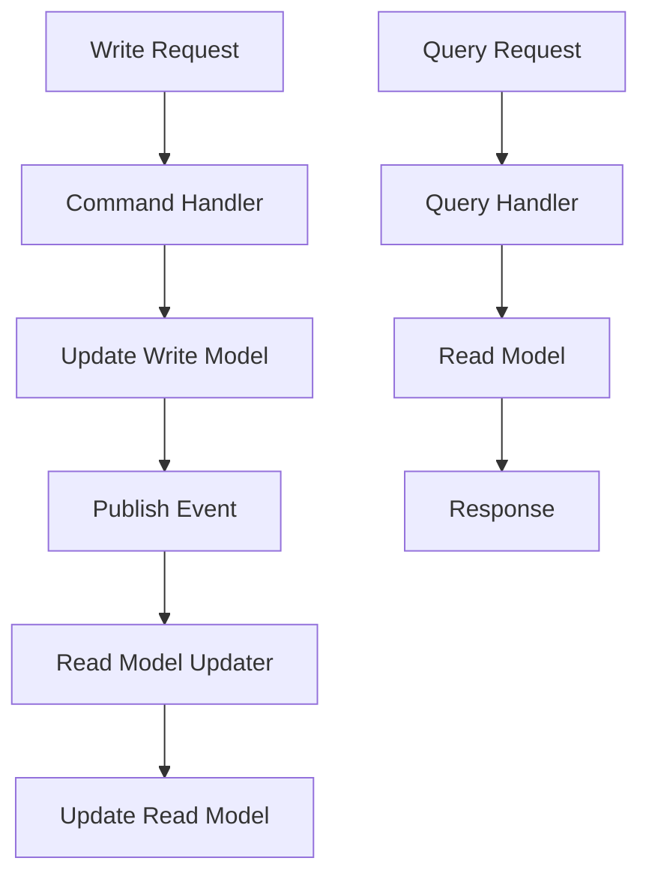

**Category:** Microservices Architecture
**Difficulty:** Intermediate
**Reading time:** 6 min read

---

CQRS separates read and write operations into distinct models and services. Write side (commands) handles state changes; read side (queries) returns data optimized for consumption. This separation enables independent scaling, optimizing each side for its requirements. CQRS pairs well with event sourcing, creating powerful architectures for complex domains.

- **Command** — Request to change state
- **Query** — Request for data without side effects
- **Write Model** — Optimized for writes (normalized)
- **Read Model** — Optimized for reads (denormalized)
- **Eventual Consistency** — Read model catches up asynchronously

CQRS separates handling of commands (writes) and queries (reads). Commands update a write model optimized for consistent, normalized writes. After successful writes, events are published. A separate read model updater listens to events and updates a read model optimized for query performance—denormalized, indexed, pre-aggregated. Queries read from the read model without touching the write model. This enables independent scaling—read model can be scaled horizontally for query load while write model remains simple. Different technologies can optimize each side—write model uses transactional database, read model uses search index or cache. The trade-off is eventual consistency—queries see slightly stale data as the read model catches up. For most applications this is acceptable; real-time consistency isn't needed. CQRS becomes complex for simple domains but provides benefits for complex read requirements. Debugging is harder—tracing issues across write and read models requires distributed tracing.

- Systems with complex, varied read requirements
- Decoupling write and read performance
- Building different views for different users
- Event sourcing with optimized read models
- Complex analytics alongside transactional writes
- Systems requiring different technologies for reads vs writes

| Advantage | Disadvantage |
|-----------|--------------|
| Independent read/write scaling | Operational complexity |
| Optimized models per operation | Eventual consistency |
| Technology flexibility | Harder to understand and debug |
| Handles complex read requirements | More infrastructure to manage |
| Complements event sourcing | Requires careful consistency design |

- [Event sourcing pattern](event-sourcing-pattern.md)
- [Event-driven architecture](event-driven-architecture.md)
- [Saga pattern for distributed transactions](saga-pattern-for-distributed-transactions.md)

---
*Part of the [Microservices Architecture](index.md) category · [Back to Master Index](../../index.md)*
