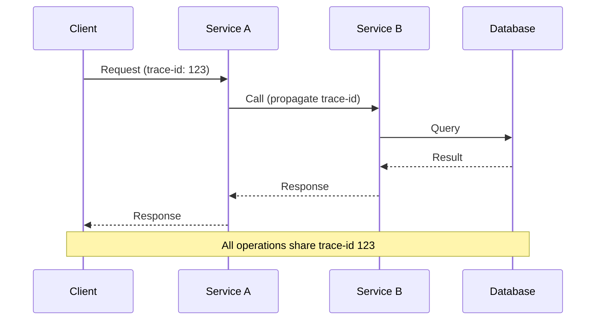

**Category:** Microservices Architecture
**Difficulty:** Intermediate
**Reading time:** 6 min read

---

Distributed tracing tracks requests flowing through multiple microservices, showing the complete execution path and timing. As requests traverse services, each service adds span information—timing, logs, tags—creating a trace showing the entire request journey. Distributed tracing is essential for understanding performance, debugging issues, and troubleshooting complex interactions in microservices systems.

- **Trace** — Complete request path across all services
- **Span** — Unit of work within a single service
- **Trace Context** — Headers propagating trace ID through services
- **Instrumentation** — Adding tracing to code
- **Exporter** — Sending traces to collection backend

When a client requests a service, a unique trace ID is generated and included in the request (usually via headers). Each service receives the trace ID and creates a span—timing and metadata for that service's work. Services propagate the trace ID when calling downstream services. Each span includes start time, duration, logs, and tags. This creates a complete picture of the request path and performance. Instrumentation frameworks automatically capture many operations (database queries, HTTP calls), reducing manual work. Traces are exported to a collection backend (like Jaeger or DataDog) where they're analyzed. Distributed tracing answers critical questions: Why is this request slow? Where is time spent? Which service is the bottleneck? It also helps with debugging—seeing exactly which service failed and why. Modern frameworks (Go, Java, Python) have standard instrumentation, making adoption easier.

- Diagnosing slow requests across multiple services
- Identifying performance bottlenecks in chains of calls
- Debugging failures in complex microservices interactions
- Understanding request paths and dependencies
- Performance optimization and tuning
- Capacity planning based on actual usage patterns

| Advantage | Disadvantage |
|-----------|--------------|
| Complete visibility into request flow | Performance overhead of instrumentation |
| Helps identify bottlenecks | Storage costs for trace data |
| Excellent for debugging | Sampling decisions can miss rare issues |
| Reveals actual dependencies | Privacy concerns with detailed tracing |
| Supports optimization efforts | Requires instrumentation in all services |

- [Service mesh benefits](service-mesh-benefits.md)
- [Circuit breaker pattern](circuit-breaker-pattern.md)
- [Microservices testing strategies](microservices-testing-strategies.md)

---
*Part of the [Microservices Architecture](index.md) category · [Back to Master Index](../../index.md)*
