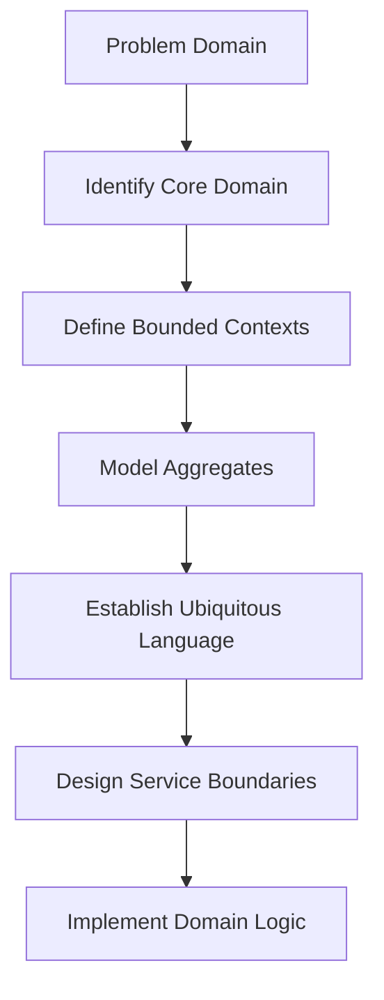

**Category:** Microservices Architecture
**Difficulty:** Intermediate
**Reading time:** 6 min read

---

Domain-Driven Design is a software approach centered on modeling the core business domain and using that model to drive architecture and code. DDD emphasizes deep domain knowledge, clear language (ubiquitous language), and strategic design patterns. When applied to microservices, DDD helps identify service boundaries through subdomains and bounded contexts, ensuring services align with business reality rather than technical convenience.

- **Domain** — The business problem being solved
- **Ubiquitous Language** — Common terminology between business and developers
- **Bounded Context** — Clear boundary where a domain model applies
- **Aggregate** — Cluster of entities and value objects treated as single unit
- **Entity vs Value Object** — Domain concepts with vs without identity

DDD starts by deeply understanding the business domain through collaboration with domain experts. This knowledge is captured in a ubiquitous language—terms and concepts that business and developers use consistently. The domain is divided into bounded contexts, each with its own model and language. Within each context, domain logic is organized around aggregates—clusters of related objects treated as atomic units. Value objects represent concepts without identity (money, distance), while entities have identity and lifecycle (customers, orders). When designing microservices with DDD, each bounded context often becomes a service boundary, ensuring services align with business domains rather than arbitrary technical divisions. This alignment improves maintainability, enables better communication with stakeholders, and reduces the risk of creating services that don't match reality.

- Building systems aligned with complex business domains
- Identifying service boundaries in microservices architectures
- Improving communication between technical and business teams
- Managing evolution of large, complex applications
- Reducing confusion from unclear terminology and boundaries
- Creating maintainable domain models

| Advantage | Disadvantage |
|-----------|--------------|
| Aligns code with business reality | Requires deep domain knowledge |
| Clear naming reduces misunderstandings | Steeper learning curve |
| Better service boundaries | Domain modeling is time-consuming |
| Improved code maintainability | Not all domains benefit equally |
| Enables team communication | Can over-engineer simple domains |

- [Service decomposition strategies](service-decomposition-strategies.md)
- [Bounded context identification](bounded-context-identification.md)
- [API-first development](api-first-development.md)

---
*Part of the [Microservices Architecture](index.md) category · [Back to Master Index](../../index.md)*
