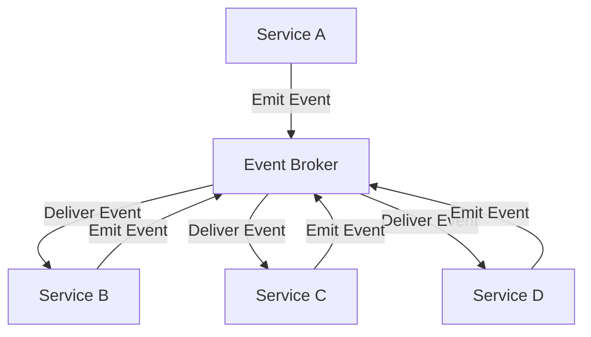

**Category:** Microservices Architecture
**Difficulty:** Intermediate
**Reading time:** 6 min read

---

Event-driven architecture decouples services by having them communicate through events. Services emit events when significant state changes occur; other services subscribe to relevant events. This asynchronous, loosely-coupled approach improves scalability, resilience, and enables complex workflows across service boundaries without tight dependencies.

- **Event** — Notification of something significant that occurred
- **Event Emitter** — Service publishing an event
- **Event Subscriber** — Service reacting to an event
- **Event Bus/Broker** — Infrastructure routing events
- **Asynchronous Processing** — Non-blocking event handling

Services emit events when significant state changes occur (OrderCreated, PaymentProcessed, InventoryAllocated). Events are published to an event broker or message bus. Services subscribe to events they care about and react accordingly. When OrderCreated event fires, multiple services react: Inventory reserves stock, Payment processes charge, Notification sends confirmation. Services don't know who consumes their events or care about downstream effects. This loose coupling enables independent evolution and scaling. Asynchronous processing means publishing services don't wait for subscribers; events are processed independently. Subscribers can process events at their own pace, with queues buffering if needed. This decoupling enables resilience—if a subscriber is slow or fails, it doesn't affect the publisher. Multiple subscribers can react to the same event independently. Ordering guarantees vary by implementation; some systems preserve order per partition, others don't guarantee order. Event schemas should be versioned to handle evolution.

- Building scalable systems with loose coupling
- Implementing complex workflows across services
- Enabling real-time reactive systems
- Decoupling producers from consumers
- Supporting multiple subscribers to same events
- Building audit trails and event histories

| Advantage | Disadvantage |
|-----------|--------------|
| Loose coupling enables flexibility | Harder to trace request flows |
| Scalable and resilient | Eventually consistent |
| Supports multiple subscribers | Operational complexity |
| Asynchronous processing improves latency | Debugging is challenging |
| Enables event audit trails | Requires message infrastructure |

- [Message broker selection](message-broker-selection.md)
- [Kafka for event streaming](kafka-for-event-streaming.md)
- [Event sourcing pattern](event-sourcing-pattern.md)

---
*Part of the [Microservices Architecture](index.md) category · [Back to Master Index](../../index.md)*
