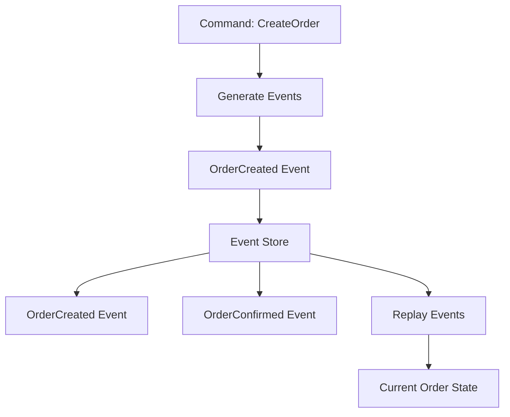

**Category:** Microservices Architecture
**Difficulty:** Intermediate
**Reading time:** 6 min read

---

Event sourcing stores application state as a sequence of immutable events that describe what happened, rather than storing current state. The complete event history is the source of truth; current state is derived by replaying events. This pattern enables event audit trails, temporal queries, and recovery while supporting event-driven architectures naturally.

- **Event** — Immutable record of state change
- **Event Store** — Append-only log of all events
- **Aggregates** — Domain objects reconstructed from events
- **Snapshots** — Cached state reducing replay time
- **Event Versioning** — Managing event schema evolution

Event sourcing inverts the traditional persistence model. Instead of writing current state to database, every state change is recorded as an immutable event. Creating an order generates OrderCreated event; charging payment generates PaymentProcessed event. All events are appended to an event store. The complete history is the source of truth. To get current state, events are replayed sequentially—starting empty, each event updates state. This seems inefficient but snapshots help—periodically, state is saved, then only events after the snapshot are replayed. Event sourcing provides complete audit trail, enabling compliance audits and understanding how state reached current value. It enables temporal queries—querying state at any past point. It supports event-driven architecture naturally—events published for subscribers. Disadvantages include operational complexity—event store design, versioning, and snapshot management require careful attention. Eventual consistency becomes visible—reading current state requires replay until consistency point. Schema evolution requires versioning—old events may use different formats than current code.

- Systems requiring complete audit trails
- Temporal analysis and historical queries
- Event-driven microservices
- Saga-based distributed transactions
- Systems requiring recovery and replay
- Building CQRS architectures

| Advantage | Disadvantage |
|-----------|--------------|
| Complete audit trail | Operational complexity |
| Historical queries possible | Eventual consistency |
| Natural event-driven support | Learning curve |
| Recovery and replay easy | Event versioning challenges |
| Temporal analysis enabled | Storage overhead |

- [CQRS (Command Query Responsibility Segregation)](cqrs-command-query-responsibility-segregation.md)
- [Event-driven architecture](event-driven-architecture.md)
- [Saga pattern for distributed transactions](saga-pattern-for-distributed-transactions.md)

---
*Part of the [Microservices Architecture](index.md) category · [Back to Master Index](../../index.md)*
