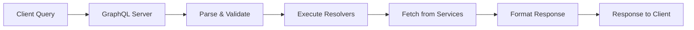

**Category:** Microservices Architecture
**Difficulty:** Intermediate
**Reading time:** 6 min read

---

GraphQL is a query language and runtime for APIs that allows clients to request exactly the data they need. Unlike REST which returns fixed representations, GraphQL enables flexible queries reducing over-fetching and under-fetching. GraphQL's strongly-typed schema and powerful query capabilities make it ideal for complex data requirements and multiple client types (web, mobile, TV).

- **GraphQL Schema** — Type definitions describing available data and operations
- **Query** — Request for specific data fields
- **Mutation** — Request to modify data
- **Resolver** — Function providing data for a schema field
- **Subscription** — Real-time data push to clients

GraphQL servers expose a schema defining all available queries, mutations, and subscriptions. Clients send queries specifying exactly which fields they need. The server parses and validates queries against the schema, then executes resolvers—functions providing data for each requested field. Resolvers can fetch from databases, call microservices, or aggregate data from multiple sources. Clients receive exactly the requested data in JSON format, avoiding both over-fetching (receiving unused fields) and under-fetching (requiring multiple requests). GraphQL enables efficient mobile clients that can minimize data transfer. Type safety through the schema provides validation and documentation. Mutations allow structured writes with proper validation. Subscriptions enable real-time features through WebSocket connections. This approach is particularly useful when serving multiple clients with different data needs from the same backend services.

- Supporting multiple client types (web, mobile, embedded)
- Reducing network bandwidth through precise field selection
- Enabling rapid frontend development with flexible queries
- Aggregating data from multiple backend services
- Building real-time applications with subscriptions
- Simplifying API evolution with schema versioning

| Advantage | Disadvantage |
|-----------|--------------|
| Clients get exactly needed data | Complexity in query optimization |
| Single endpoint, flexible queries | Steeper learning curve |
| Strong type system and validation | Can be harder to cache than REST |
| Excellent developer experience | Query complexity must be managed |
| Ideal for multiple client types | Requires different infrastructure changes |

- [RESTful API design](restful-api-design.md)
- [gRPC for microservices](grpc-for-microservices.md)
- [API gateway patterns](api-gateway-patterns.md)

---
*Part of the [Microservices Architecture](index.md) category · [Back to Master Index](../../index.md)*
