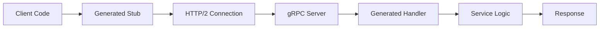

**Category:** Microservices Architecture
**Difficulty:** Intermediate
**Reading time:** 6 min read

---

gRPC is a high-performance, modern RPC framework using Protocol Buffers and HTTP/2. It enables efficient service-to-service communication with strong typing, code generation, and binary serialization. gRPC is ideal for microservices requiring low latency, high throughput, or real-time communication. Its streaming capabilities and language-agnostic design make it a powerful alternative to REST for internal service communication.

- **Protocol Buffers (Protobuf)** — Efficient binary serialization format
- **RPC (Remote Procedure Call)** — Calling functions on remote services
- **HTTP/2** — Modern protocol with multiplexing and binary framing
- **Streaming** — Bidirectional data flow between client and server
- **Code Generation** — Automatic client/server stub creation from definitions

gRPC uses Protocol Buffers to define service interfaces and message types in a language-agnostic `.proto` file. Code generators create strongly-typed client and server stubs for multiple languages. Clients make RPC calls that look like local function calls but are actually network requests. Communication occurs over HTTP/2, providing binary efficiency and multiplexing—multiple requests share one TCP connection. Binary Protobuf serialization is more compact than JSON, reducing bandwidth. gRPC supports four communication modes: unary (request-response), server streaming, client streaming, and bidirectional streaming. This enables efficient patterns like pushing data streams or handling real-time updates. Strong typing and code generation catch errors early and improve development speed. The HTTP/2 foundation means gRPC works through proxies and firewalls like HTTP services.

- High-performance microservice-to-microservice communication
- Services requiring low latency and high throughput
- Real-time data streaming between services
- Polyglot microservices (using multiple languages)
- Building service meshes with sidecar proxies
- Services requiring binary efficiency

| Advantage | Disadvantage |
|-----------|--------------|
| High performance and efficiency | Not browser-friendly (HTTP/2 limitations) |
| Strong typing and contracts | Less human-readable (binary) |
| Code generation reduces errors | Smaller ecosystem than REST |
| Excellent streaming support | Requires learning Protobuf |
| Language-agnostic design | Debugging harder than REST |

- [RESTful API design](restful-api-design.md)
- [API gateway patterns](api-gateway-patterns.md)
- [Service mesh benefits](service-mesh-benefits.md)

---
*Part of the [Microservices Architecture](index.md) category · [Back to Master Index](../../index.md)*
