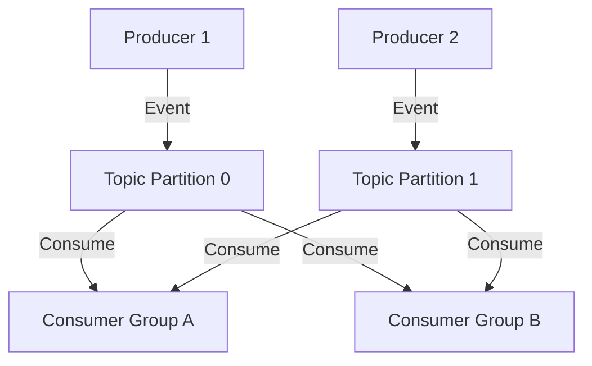

**Category:** Microservices Architecture
**Difficulty:** Intermediate
**Reading time:** 6 min read

---

Apache Kafka is a distributed streaming platform designed for high-throughput, fault-tolerant event streaming. It acts as a distributed log where producers append events and consumers read from any position. Kafka's architecture enables scaling to millions of events per second while providing strong ordering guarantees per partition. It has become the default choice for event-driven microservices architectures.

- **Topic** — Named stream of events
- **Partition** — Sharded topic for parallelism and scalability
- **Producer** — Service writing events to Kafka
- **Consumer** — Service reading events from Kafka
- **Offset** — Consumer's position in partition's event stream

Kafka organizes events into topics (e.g., orders, payments). Each topic has partitions—shards enabling parallel processing. Producers write events to topics; Kafka distributes across partitions via key-based hashing. Consumers read from partitions, tracking their offset (position). Multiple consumers form consumer groups; each partition is consumed by one group member. This enables scaling—more partitions allow more parallel consumers. Kafka stores events durably and retains them for configurable periods, allowing consumers to replay events or fall behind without loss. Ordering is guaranteed per partition—events with the same key always go to the same partition, maintaining order. This is crucial for operations like account balance updates. Kafka's distributed architecture provides fault tolerance—replicas across brokers ensure data survives failures. Producer and consumer configuration trades off durability vs latency. Strong durability requires synchronous replication before acknowledgment, reducing throughput but guaranteeing no loss.

- High-throughput event streaming
- Building event audit logs
- Decoupling services with events
- Real-time analytics and monitoring
- Event replay and recovery
- Building event-sourced systems

| Advantage | Disadvantage |
|-----------|--------------|
| Massive scalability | Operational complexity |
| Strong ordering per partition | Learning curve (Zookeeper, configs) |
| Event durability and replay | Resource consumption |
| Fault-tolerant architecture | Not ideal for low-throughput use cases |
| Flexible consumer groups | Requires partitioning strategy |

- [RabbitMQ message queuing](rabbitmq-message-queuing.md)
- [Event-driven architecture](event-driven-architecture.md)
- [Event sourcing pattern](event-sourcing-pattern.md)

---
*Part of the [Microservices Architecture](index.md) category · [Back to Master Index](../../index.md)*
