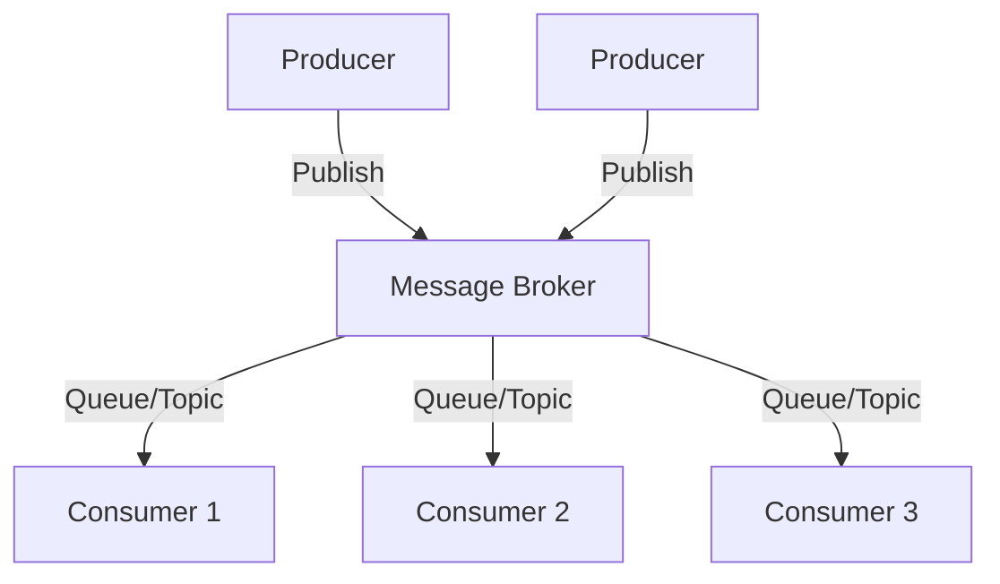

**Category:** Microservices Architecture
**Difficulty:** Intermediate
**Reading time:** 6 min read

---

Message brokers like Kafka, RabbitMQ, and AWS SQS provide infrastructure for asynchronous communication in microservices. Different brokers offer varying guarantees, scalability characteristics, and operational requirements. Choosing the right broker depends on requirements for throughput, latency, retention, ordering, and operational complexity. Proper selection impacts system reliability and performance significantly.

- **Message Broker** — Service routing messages between producers and consumers
- **Queue** — FIFO message ordering (RabbitMQ model)
- **Topic** — Pub/sub messaging model with multiple subscribers
- **Partition** — Scalability unit enabling parallel processing
- **Offset** — Consumer position in message stream

Message brokers decouple producers from consumers, allowing independent scaling and failure handling. Producers send messages without knowing consumers; the broker stores and delivers messages. Different brokers optimize for different use cases. RabbitMQ excels at traditional queuing with strong routing and delivery guarantees. Kafka scales to massive throughput with partitioned topics and acts as a distributed log. Amazon SQS provides managed queuing without operational overhead. Message ordering can be guaranteed per partition (Kafka) or queue (RabbitMQ) but not globally across parallel consumers. Consumers track their progress (offset/position) allowing replay or recovery. Dead letter queues capture failed messages for investigation. Retention policies vary—queues often delete after delivery, while Kafka retains for configurable periods. Throughput requirements drive partitioning strategy; higher throughput needs more partitions but increases operational complexity. Latency requirements affect batch sizing; smaller batches reduce latency but decrease efficiency.

- Asynchronous task processing
- Event streaming and real-time analytics
- Decoupling microservices communication
- Buffering traffic spikes
- Implementing publish-subscribe patterns
- Building event audit trails

| Advantage | Disadvantage |
|-----------|--------------|
| Decouples producers and consumers | Additional infrastructure to manage |
| Scales independently | Operational complexity |
| Resilient to failures | Cost of message storage |
| Supports multiple consumers | Eventual consistency |
| Built-in backpressure handling | Requires careful partitioning |

- [Kafka for event streaming](kafka-for-event-streaming.md)
- [RabbitMQ message queuing](rabbitmq-message-queuing.md)
- [Event-driven architecture](event-driven-architecture.md)

---
*Part of the [Microservices Architecture](index.md) category · [Back to Master Index](../../index.md)*
