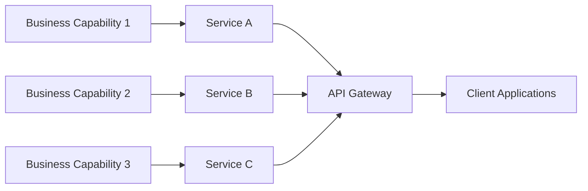

**Category:** Microservices Architecture
**Difficulty:** Intermediate
**Reading time:** 6 min read

---

Microservices design principles guide the creation of loosely-coupled, independently-deployable services that work together to build large applications. These principles emphasize single responsibility, clear boundaries, and operational independence while maintaining system cohesion. Understanding these core principles is essential for successful microservices implementation.

- **Single Responsibility Principle** — Each service handles one business capability
- **Loose Coupling** — Services depend on abstractions, not implementations
- **High Cohesion** — Related functionality grouped within services
- **Autonomous Services** — Each service can be developed, deployed, and scaled independently
- **Observable Services** — Services emit clear signals about their state and behavior

Microservices design begins by identifying discrete business capabilities or domains and creating autonomous services around them. Each service owns its data, logic, and infrastructure, allowing independent scaling and deployment. Services communicate through well-defined APIs (REST, gRPC, async messaging) using explicit contracts rather than shared libraries. This separation enables teams to work independently on their services using different technologies if appropriate. The principle of autonomy means each service can have its own database, avoiding tight coupling through shared data stores. Services expose clear, stable APIs that act as boundaries, allowing internal implementation changes without affecting consumers. This architectural approach enables faster development cycles, easier scaling, and better fault isolation.

- Large applications requiring independent scaling of components
- Organizations with multiple teams owning different capabilities
- Systems requiring different technology stacks for different features
- Rapid deployment needs with low risk of broad outages
- Building resilient systems where partial failures don't cascade
- Managing complexity in growing codebases

| Advantage | Disadvantage |
|-----------|--------------|
| Independent scaling per service | Increased operational complexity |
| Easy to deploy individual services | Distributed system challenges |
| Teams work independently | Network latency concerns |
| Technology flexibility per service | Data consistency challenges |
| Easier to understand small codebases | Monitoring and debugging harder |

- [Service decomposition strategies](service-decomposition-strategies.md)
- [Domain-Driven Design (DDD)](domain-driven-design-ddd.md)
- [API gateway patterns](api-gateway-patterns.md)

---
*Part of the [Microservices Architecture](index.md) category · [Back to Master Index](../../index.md)*
