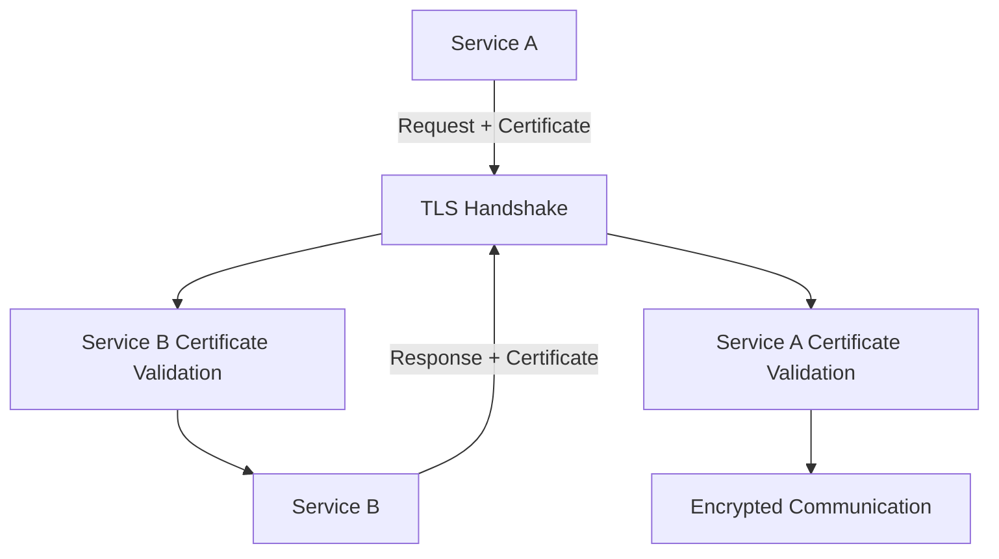

**Category:** Microservices Architecture
**Difficulty:** Intermediate
**Reading time:** 6 min read

---

Microservices security extends beyond traditional network perimeter security to protect service-to-service communication, validate service identity, and enforce least-privilege access. Key concerns include mutual TLS between services, service authentication, API authorization, and preventing lateral movement. Security must be built into architecture from the start rather than bolted on afterward.

- **Mutual TLS (mTLS)** — Two-way encryption and authentication
- **Service Identity** — Unique identity for each service instance
- **Least Privilege** — Services have minimal required permissions
- **API Authorization** — Fine-grained access control
- **Secret Management** — Secure handling of credentials

Microservices security starts with mutual authentication—each service has a certificate proving its identity. Services verify each other's certificates before communicating, establishing encrypted channels. Service mesh proxies (Istio, Linkerd) often handle mTLS automatically, requiring only configuration. API authorization controls which services can call which APIs—enforced through policies rather than network isolation. Secrets (database passwords, API keys) must be securely injected into services, typically through secret managers like Vault or Kubernetes Secrets. Service accounts (identities) enable fine-grained permissions—only necessary permissions are granted. Network policies limit communication to intended paths, enabling microsegmentation. Regular scanning detects vulnerabilities in dependencies. Security isn't just infrastructure; application code must validate inputs, handle errors securely, and avoid information leakage. Defense in depth means multiple layers—even if one fails, others provide protection. Compliance requirements (HIPAA, PCI) drive security policies and monitoring requirements.

- Protecting service-to-service communication
- Preventing unauthorized service access
- Enforcing least-privilege principles
- Compliance with security regulations
- Incident response and forensics
- Reducing blast radius from compromises

| Advantage | Disadvantage |
|-----------|--------------|
| Strong service authentication | Performance overhead of encryption |
| Least privilege enforcement | Configuration complexity |
| Reduced blast radius from breaches | Operational overhead |
| Compliance support | Debugging more complex with security |
| Defense in depth possible | Requires security expertise |

- [Service-to-service authentication](service-to-service-authentication.md)
- [API authentication and authorization](api-authentication-and-authorization.md)
- [OAuth 2.0 for microservices](oauth-20-for-microservices.md)

---
*Part of the [Microservices Architecture](index.md) category · [Back to Master Index](../../index.md)*
