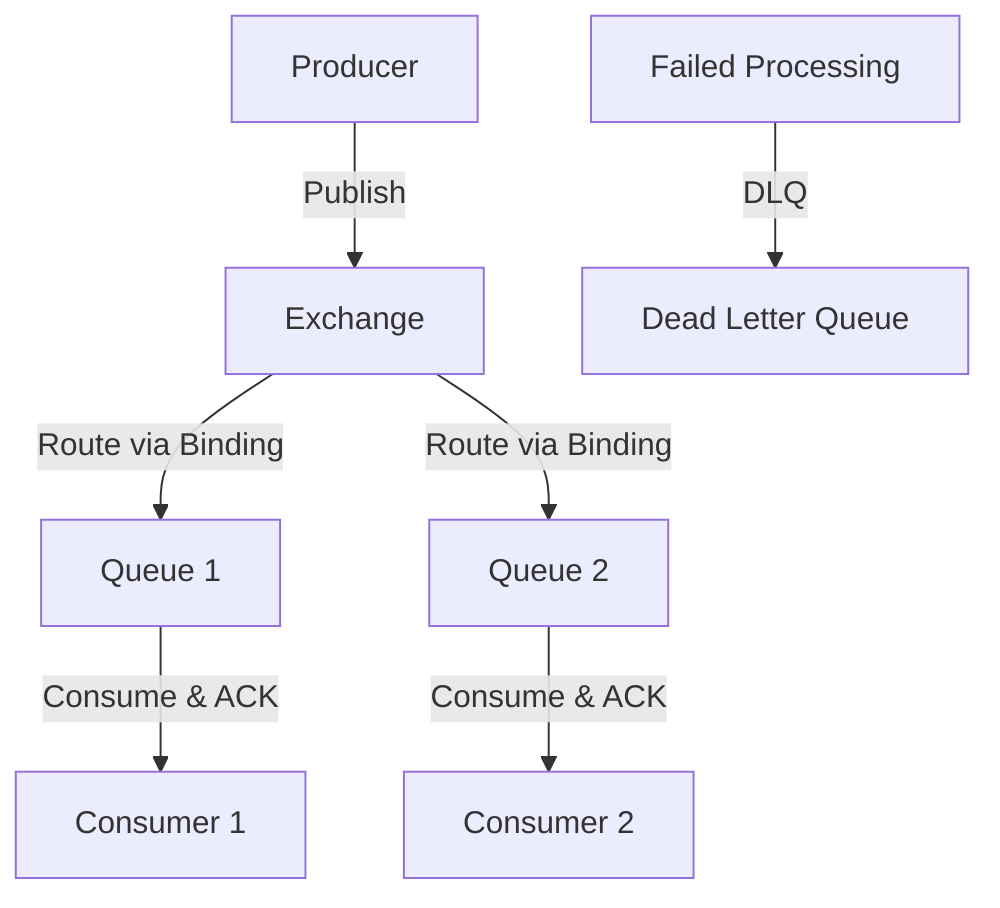

**Category:** Microservices Architecture
**Difficulty:** Intermediate
**Reading time:** 6 min read

---

RabbitMQ is a message broker implementing the AMQP protocol, providing reliable message queuing with flexible routing. Unlike Kafka's stream-oriented model, RabbitMQ focuses on queues and task distribution. Its powerful routing, acknowledgment mechanisms, and dead letter queues make it ideal for reliable task processing and complex event routing scenarios.

- **Queue** — FIFO buffer for messages
- **Exchange** — Routing component distributing messages to queues
- **Binding** — Connection between exchange and queue with routing rules
- **Acknowledgment** — Consumer confirming message processing
- **Dead Letter Queue** — Destination for failed messages

RabbitMQ separates publishing from consumption through exchanges and queues. Producers publish messages to exchanges without knowing which queues consume them. Exchanges route based on bindings—rules connecting exchanges to queues. Different exchange types (direct, topic, fanout) enable various routing patterns. Direct exchange routes by exact key match, topic exchange supports wildcard matching, fanout broadcasts to all bound queues. Consumers pull from queues at their own pace. Crucially, consumers send acknowledgments when done processing, only then removing messages from the queue. If a consumer crashes without acknowledging, messages remain in the queue for redelivery. Dead letter exchanges capture messages that can't be delivered, enabling investigation and recovery. RabbitMQ guarantees delivery—messages are persisted to disk before delivery. This reliability comes at throughput cost—Kafka handles higher volumes, but RabbitMQ is sufficient for most applications. Memory and disk buffering of messages provides backpressure handling—slow consumers don't impact publishers.

- Reliable task queuing and distribution
- Complex event routing patterns
- Request-response patterns with return routing
- Rate limiting and load management
- Guaranteed message delivery
- Dead letter queue processing for error handling

| Advantage | Disadvantage |
|-----------|--------------|
| Simple, reliable message queuing | Lower throughput than Kafka |
| Flexible routing capabilities | Memory consumption for buffering |
| Acknowledgment guarantees delivery | Less suitable for streaming |
| Dead letter queue support | Smaller ecosystem for analytics |
| AMQP standardization | Queue-per-consumer scaling limits |

- [Kafka for event streaming](kafka-for-event-streaming.md)
- [Message broker selection](message-broker-selection.md)
- [Event-driven architecture](event-driven-architecture.md)

---
*Part of the [Microservices Architecture](index.md) category · [Back to Master Index](../../index.md)*
