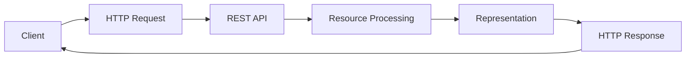

**Category:** Microservices Architecture
**Difficulty:** Intermediate
**Reading time:** 6 min read

---

RESTful API design follows principles of REST (Representational State Transfer) to create scalable, maintainable web services. REST APIs use standard HTTP methods, treat resources as first-class entities, and provide stateless interactions. This approach has become the dominant pattern for microservices communication due to its simplicity, standardization, and compatibility with HTTP infrastructure.

- **Resource** — Entity identified by URI (e.g., /customers/123)
- **Representation** — JSON, XML data representing resource state
- **HTTP Methods** — GET, POST, PUT, DELETE, PATCH for standard operations
- **Status Codes** — 2xx success, 4xx client error, 5xx server errors
- **Stateless** — Each request contains all information needed; no session stored on server

REST APIs organize functionality around resources identified by URIs. Each resource (customer, order, product) has a URI path. Standard HTTP methods perform operations: GET retrieves, POST creates, PUT updates, DELETE removes. Responses include HTTP status codes indicating success or failure, and representations of resources typically in JSON format. APIs should follow conventions for naming (plural nouns for collections), filtering (query parameters), pagination, and versioning. Error responses should include appropriate status codes and error details. REST's stateless nature means servers don't maintain client session state, improving scalability. Each request is independent and contains all information needed. This constraint simplifies horizontal scaling and enables caching at HTTP level. Proper REST design improves clarity, reduces cognitive load, and enables developers to understand APIs intuitively based on standard patterns.

- Building public APIs for web and mobile clients
- Microservice communication in modern architectures
- Exposing business functionality to external partners
- Creating CRUD operations for resources
- Building traditional web application backends
- Enabling client-server systems with minimal coupling

| Advantage | Disadvantage |
|-----------|--------------|
| Simple and well-understood | Can be inefficient for complex queries |
| HTTP-friendly, caching works well | Versioning can be problematic |
| Clear resource organization | Limited to CRUD operations |
| Stateless scaling advantages | Over-fetching and under-fetching issues |
| Self-documenting with conventions | Not ideal for real-time systems |

- [GraphQL API architecture](graphql-api-architecture.md)
- [gRPC for microservices](grpc-for-microservices.md)
- [API versioning strategies](api-versioning-strategies.md)

---
*Part of the [Microservices Architecture](index.md) category · [Back to Master Index](../../index.md)*
