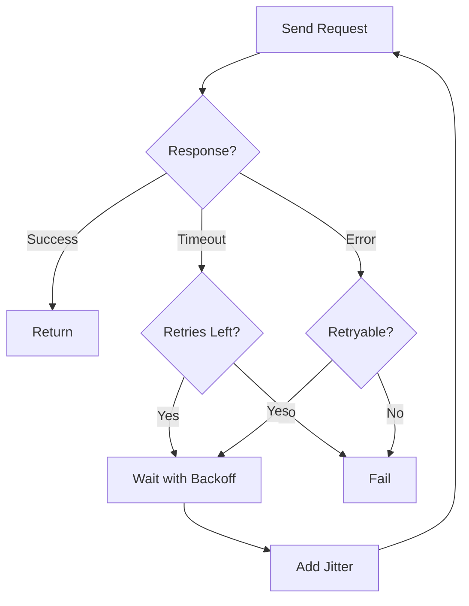

**Category:** Microservices Architecture
**Difficulty:** Intermediate
**Reading time:** 6 min read

---

Retry and timeout strategies manage failures in distributed systems. Timeouts prevent indefinite waiting for unresponsive services, while retries help recover from transient failures. Combining these strategies with exponential backoff and jitter prevents cascading failures and improves system resilience. Proper implementation is critical as aggressive retries can amplify problems.

- **Timeout** — Maximum time to wait for a response
- **Retry** — Resending a request after failure
- **Exponential Backoff** — Increasing delay between retries
- **Jitter** — Random delay preventing thundering herd
- **Idempotency** — Requests safe to retry without side effects

Timeouts define maximum wait time for each request. Short timeouts fail fast but risk false positives on slow services. Long timeouts reduce false failures but increase latency on actual failures. Timeouts should match service SLAs plus network overhead. Retries help handle transient failures (network glitches, temporary service issues). Only safe-to-retry requests should be retried—requests that don't have side effects or can be safely re-executed. Exponential backoff increases delay between retries: first retry after 100ms, second after 200ms, third after 400ms. This prevents overwhelming recovering services. Jitter adds randomness to backoff, preventing thundering herd where all clients retry simultaneously. Combining retries with circuit breakers prevents retry amplification—once a service fails consistently, circuit breakers stop retries. The retry budget should be limited; excessive retries waste resources and amplify problems. Different services may need different retry strategies based on their characteristics.

- Recovering from transient network failures
- Handling temporary service unavailability
- Preventing indefinite hangs on unresponsive services
- Improving reliability without increasing implementation complexity
- Protecting against partial outages
- Balancing availability and latency

| Advantage | Disadvantage |
|-----------|--------------|
| Improves resilience to transient failures | Can amplify problems if misconfigured |
| Relatively simple to implement | Requires idempotent operations |
| Prevents indefinite hangs | Increases latency on failures |
| Works with existing services | Complex to tune correctly |
| Reduces perceived errors | Can cause cascading load |

- [Circuit breaker pattern](circuit-breaker-pattern.md)
- [Bulkhead pattern](bulkhead-pattern.md)
- [Service mesh benefits](service-mesh-benefits.md)

---
*Part of the [Microservices Architecture](index.md) category · [Back to Master Index](../../index.md)*
