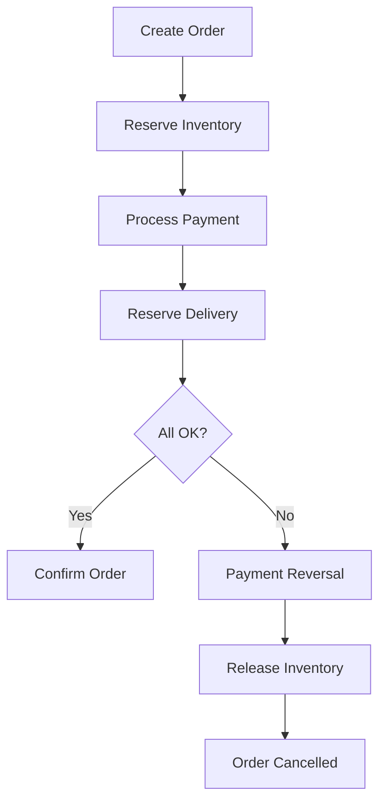

**Category:** Microservices Architecture
**Difficulty:** Intermediate
**Reading time:** 6 min read

---

The saga pattern enables multi-step transactions across microservices without distributed ACID transactions. Sagas orchestrate sequences of local transactions and compensating actions, ensuring consistency across service boundaries. Two approaches—choreography and orchestration—offer different trade-offs in complexity and autonomy. Sagas are essential for maintaining data consistency in microservices architectures.

- **Saga** — Sequence of transactions across multiple services
- **Choreography** — Services react to events, coordinating implicitly
- **Orchestration** — Central coordinator directs service actions
- **Compensating Action** — Reversal of a transaction on failure
- **Eventual Consistency** — System reaches consistency over time

Sagas break multi-step transactions into local transactions within each service. When ordering, the Order service creates an order, the Inventory service reserves stock, and the Payment service charges. Each service's local transaction commits immediately. If any step fails, compensating actions run to undo previous steps. Choreography has services react to events—Order Service publishes OrderCreated, Inventory Service listens and reserves stock, publishing InventoryReserved, which triggers Payment Service. Services coordinate implicitly through events. Orchestration uses a central coordinator directing steps—the Saga Orchestrator tells Inventory Service to reserve, then tells Payment Service to charge. Orchestration is easier to understand and manage but creates centralization. Choreography is more autonomous but harder to debug. Sagas ensure eventual consistency—the system reaches a consistent state eventually but may be inconsistent momentarily. This is acceptable for most business processes but not for all use cases. Compensation must be idempotent; if a compensation fails, it should be safely retryable.

- Multi-step business processes spanning services
- Maintaining consistency without distributed transactions
- Handling long-running processes
- Implementing order processing and workflows
- Managing financial transactions across services
- Coordinating cross-service operations

| Advantage | Disadvantage |
|-----------|--------------|
| No distributed transaction overhead | Eventual consistency only |
| Scales horizontally | Compensations can be complex |
| Works with heterogeneous databases | Harder to reason about |
| Explicit failure handling | Debugging is challenging |
| Clear compensation logic | Requires idempotent operations |

- [Event-driven architecture](event-driven-architecture.md)
- [Message broker selection](message-broker-selection.md)
- [Kafka for event streaming](kafka-for-event-streaming.md)

---
*Part of the [Microservices Architecture](index.md) category · [Back to Master Index](../../index.md)*
