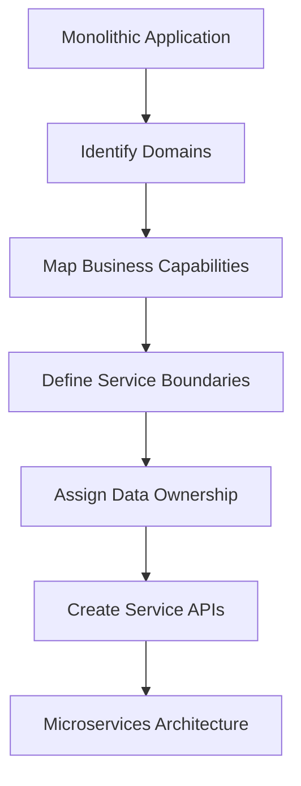

**Category:** Microservices Architecture
**Difficulty:** Intermediate
**Reading time:** 6 min read

---

Service decomposition strategies define how to break down monolithic applications into manageable microservices. Different approaches—by business capability, by subdomain, by technical layer, or by scaling needs—offer varying benefits. Choosing the right decomposition strategy is critical to achieving microservices benefits while avoiding architectural pitfalls like circular dependencies or overly fine-grained services.

- **Capability-Based Decomposition** — Services organized around business capabilities
- **Domain-Based Decomposition** — Services aligned with business domains and subdomains
- **Layer-Based Decomposition** — Services organized by technical layers (problematic)
- **Data-Driven Decomposition** — Services organized around data entities
- **Strangler Fig Pattern** — Gradually replacing monolith components with services

Service decomposition begins with understanding the business domain and identifying distinct capabilities or subdomains. Capability-based approaches organize services around what a business does (e.g., Orders, Payments, Shipping), while domain-based approaches use business subdomains from domain-driven design. The key is identifying cohesive units with minimal external dependencies. Once boundaries are defined, data ownership must be clarified—each service should own its data with interfaces for queries from other services. Decomposition should be driven by team structure and scaling needs, not by technical layers. The strangler fig pattern allows gradual migration from monoliths, wrapping old code with service adapters while new services are built. This evolutionary approach reduces risk compared to big-bang rewrites.

- Breaking down legacy monoliths into manageable services
- Defining service boundaries for new microservices systems
- Improving deployment speed by reducing service scope
- Organizing services to align with team structure
- Enabling independent scaling of high-demand capabilities
- Reducing merge conflicts and deployment coordination

| Advantage | Disadvantage |
|-----------|--------------|
| Aligns with business structure | Risk of wrong initial boundaries |
| Clear ownership and responsibility | Requires domain knowledge |
| Enables gradual migration | Difficult to change boundaries later |
| Improves deployment velocity | May create chatty inter-service communication |
| Reduces team coordination | Data consistency becomes complex |

- [Microservices design principles](microservices-design-principles.md)
- [Domain-Driven Design (DDD)](domain-driven-design-ddd.md)
- [Bounded context identification](bounded-context-identification.md)

---
*Part of the [Microservices Architecture](index.md) category · [Back to Master Index](../../index.md)*
