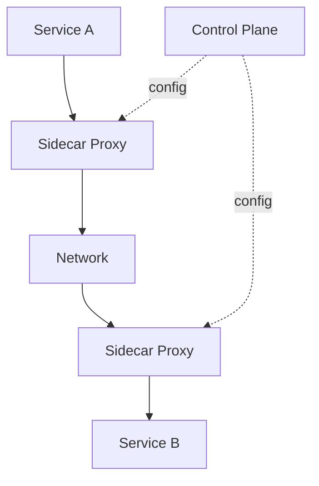

**Category:** Microservices Architecture
**Difficulty:** Intermediate
**Reading time:** 6 min read

---

Service meshes provide infrastructure for managing service-to-service communication in microservices architectures. By deploying sidecar proxies alongside services, meshes enable traffic management, security policies, observability, and resilience without modifying application code. Service meshes have become critical infrastructure for large-scale microservices deployments.

- **Service Mesh** — Infrastructure layer managing service communication
- **Sidecar Proxy** — Lightweight proxy deployed alongside each service
- **Control Plane** — Centralized configuration and policy management
- **Data Plane** — Collection of proxies handling actual traffic
- **Service Discovery** — Automatic service location and load balancing

Service meshes deploy lightweight sidecar proxies (like Envoy) alongside each service instance. These proxies intercept all inbound and outbound traffic, implementing policies and observability without application changes. The control plane (like Istio's control plane) manages configuration, service discovery, and policy distribution. Traffic can be intelligently routed based on headers, percentages, or other criteria. Meshes enforce security policies like mutual TLS between services. Retries, timeouts, and circuit breaking are implemented transparently. Observability is built-in—proxies emit detailed traffic metrics. Resilience patterns become infrastructure concerns rather than application responsibility. Deployments can use canary releases or blue-green updates through mesh configuration. This architecture separates networking concerns from application logic, enabling specialized teams to manage each layer independently.

- Managing traffic in complex microservices architectures
- Implementing service-to-service security policies
- Enabling sophisticated traffic patterns (canary, blue-green)
- Providing detailed observability of service communication
- Enforcing resilience patterns transparently
- Managing multi-version or multi-cluster deployments

| Advantage | Disadvantage |
|-----------|--------------|
| Communication management without code changes | Additional operational complexity |
| Built-in observability and metrics | Performance overhead from proxies |
| Sophisticated traffic management possible | Harder debugging with extra layer |
| Centralized security policies | Learning curve for mesh concepts |
| Infrastructure scales with services | Resource consumption increases |

- [Distributed tracing for microservices](distributed-tracing-for-microservices.md)
- [Circuit breaker pattern](circuit-breaker-pattern.md)
- [Microservices security](microservices-security.md)

---
*Part of the [Microservices Architecture](index.md) category · [Back to Master Index](../../index.md)*
