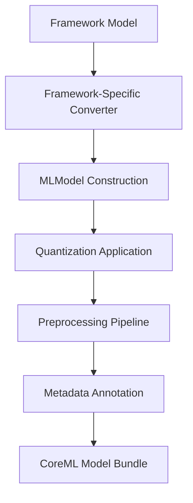

**Category:** Model Optimization Services
**Difficulty:** Intermediate
**Reading time:** 6 min read

---

CoreML model conversion transforms deep learning models from PyTorch, TensorFlow, and scikit-learn into Apple's CoreML format for iOS, macOS, watchOS, and tvOS deployment. The conversion enables hardware acceleration on Apple Silicon and Neural Engine while maintaining privacy through on-device inference.

- **MLModel Format** — Apple's protobuf-based model serialization
- **Flexible Input/Output** — Supports multiple data types (image, text, numbers)
- **Hardware Acceleration** — CPU, GPU, and Neural Engine backends
- **Quantization Support** — INT8 and 16-bit quantization for size reduction
- **Metadata Embedding** — Feature descriptions, preprocessing, and model versioning

Framework-specific converters (coremltools) read model checkpoints and construct CoreML neural network layers, mapping framework operations to CoreML equivalents. The converter handles type conversions and data layout transformations (NCHW to NHWC). Optional quantization reduces precision for storage efficiency. The converter embeds preprocessing specifications (image normalization, resizing) enabling single-line inference with raw inputs. Output layers can specify feature descriptions and class labels. The final .mlmodel file bundles topology, weights, and metadata in protobuf format. At runtime, Core ML automatically selects the optimal execution backend based on model characteristics and device capabilities.

- iOS app on-device machine learning (image recognition, text analysis)
- Wearable device inference (watchOS complications and complications)
- macOS desktop AI applications
- Privacy-preserving facial recognition
- Real-time video analysis without cloud connectivity
- App Extensions for shared ML models

| Advantage | Disadvantage |
|-----------|--------------|
| Tight OS integration, native Swift/ObjC APIs | Apple ecosystem-specific deployment |
| Excellent Neural Engine acceleration on A/M chips | Limited to macOS/iOS/watchOS platforms |
| On-device privacy by default | Model size still larger than TFLite |
| Automated hardware backend selection | Smaller community than TensorFlow/PyTorch |
| Native preprocessing integration | Limited debugging tools and visibility |

- [PyTorch Mobile Optimization](pytorch-mobile-optimization.md)
- [TensorFlow Lite Conversion](tensorflow-lite-conversion.md)
- [Model Quantization INT8 INT4](model-quantization-int8-int4.md)

---
*Part of the [Model Optimization Services](index.md) category · [Back to Master Index](../../index.md)*
