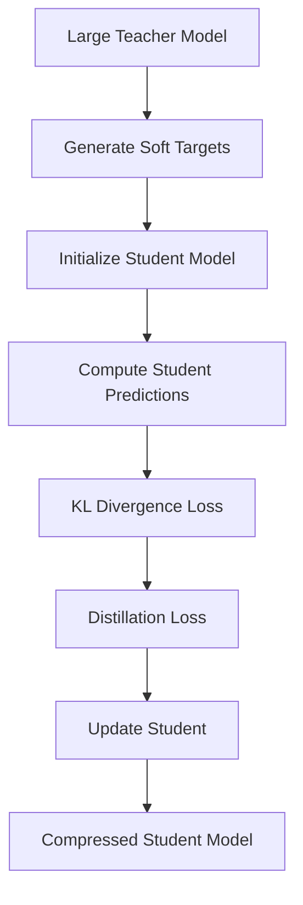

**Category:** Model Optimization Services
**Difficulty:** Intermediate
**Reading time:** 6 min read

---

Knowledge distillation compresses large teacher models into smaller student models by training students to mimic teacher predictions. This technique preserves performance while reducing model size and inference latency, making it ideal for deployment scenarios with strict resource constraints.

- **Teacher-Student Framework** — Large teacher guides training of smaller student
- **Soft Targets** — Using probability distributions instead of hard labels
- **Temperature Scaling** — Controlling softness of teacher probabilities
- **Feature Distillation** — Matching intermediate layer activations
- **Progressive Distillation** — Multi-stage compression with intermediate teachers

Knowledge distillation trains a smaller student network to replicate a larger teacher network's behavior. The teacher (already trained) generates soft probability distributions over classes by applying temperature scaling, which softens the probability distribution. The student network is trained with a combined loss: matching the teacher's soft targets (distillation loss) plus matching ground truth labels (task loss). Temperature T controls softness: higher T produces softer distributions revealing more about teacher's uncertainty. The distillation process transfers generalization knowledge from teacher to student, allowing students to achieve surprising performance with far fewer parameters. Progressive distillation uses intermediate-sized teachers to gradually compress.

- Compressing large language models for inference
- Creating mobile versions of desktop models
- Real-time inference on edge devices
- Cost-effective cloud inference scaling
- Knowledge transfer between architectures
- Ensemble compression into single model

| Advantage | Disadvantage |
|-----------|--------------|
| Significant compression with minimal loss | Requires training large teacher first |
| Works across different architectures | Hyperparameter tuning critical |
| Can combine with pruning & quantization | Computational cost during training |
| Improves generalization & robustness | Not all architectures suitable for distillation |
| Flexible student architecture design | Incremental gains after first compression |

- [Model Pruning Techniques](model-pruning-techniques.md)
- [Model Quantization INT8 INT4](model-quantization-int8-int4.md)
- [Neural Architecture Search NAS](neural-architecture-search-nas.md)

---
*Part of the [Model Optimization Services](index.md) category · [Back to Master Index](../../index.md)*
