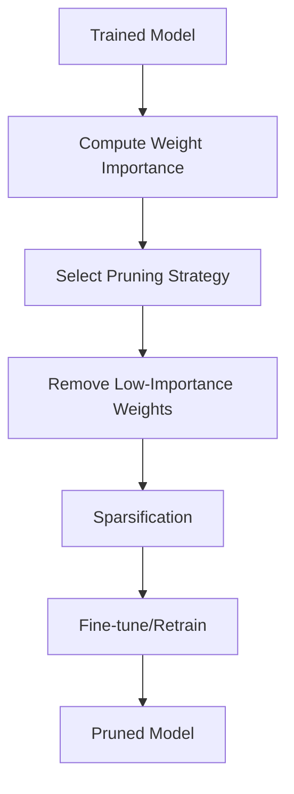

**Category:** Model Optimization Services
**Difficulty:** Intermediate
**Reading time:** 6 min read

---

Model pruning removes redundant weights, filters, or connections from neural networks, reducing model size and inference latency. Pruning strategies range from simple magnitude-based approaches to sophisticated techniques that maintain accuracy while aggressively reducing parameters.

- **Structured Pruning** — Removes entire channels/filters enabling hardware acceleration
- **Unstructured Pruning** — Removes individual weights, requiring sparse tensor support
- **Magnitude Pruning** — Removes weights below learned or static thresholds
- **Gradual Pruning** — Incrementally prunes during training for smoother convergence
- **Fine-tuning** — Retraining to recover accuracy after pruning

Pruning begins by analyzing weight importance through various metrics: magnitude, gradient-based, or learned importance scores. Magnitude pruning identifies weights near zero as redundant. Structured pruning removes entire output channels, which translates to removing corresponding filter rows/columns in subsequent layers. Unstructured pruning simply zeros out individual weights. After pruning, the model is fine-tuned to recover accuracy lost during weight removal. Gradual pruning applies sparsity progressively during training, allowing the model to adapt. The pruned model may benefit from further quantization or knowledge distillation.

- Reducing model size for mobile deployment
- Accelerating inference on CPUs with structured pruning
- Improving energy efficiency on edge devices
- Compression combined with quantization
- Model ensemble reduction
- Parameter-efficient transfer learning

| Advantage | Disadvantage |
|-----------|--------------|
| Significant size reduction (10-90x possible) | Requires fine-tuning to maintain accuracy |
| Works with trained models, no retraining needed | Structured pruning hardware limited |
| Combines well with quantization | Unstructured needs sparse tensor support |
| Improves energy efficiency | Aggressive pruning requires careful tuning |
| Framework-agnostic approaches available | Inferencing speedup depends on hardware |

- [Structured Pruning](structured-pruning.md)
- [Unstructured Pruning](unstructured-pruning.md)
- [Knowledge Distillation](knowledge-distillation.md)

---
*Part of the [Model Optimization Services](index.md) category · [Back to Master Index](../../index.md)*
