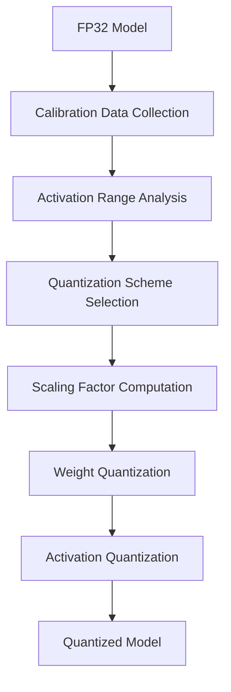

**Category:** Model Optimization Services
**Difficulty:** Intermediate
**Reading time:** 6 min read

---

Model quantization reduces neural network precision from FP32 to 8-bit or 4-bit integers, dramatically decreasing model size and inference latency. INT8 provides 4x compression with minimal accuracy loss, while INT4 enables 8x compression suitable for edge and edge-constrained scenarios.

- **Quantization Granularity** — Per-tensor, per-channel, per-group approaches
- **Symmetric vs Asymmetric** — Different scaling schemes for efficient computation
- **Calibration Methods** — Min-max, entropy, KL-divergence, percentile-based
- **Mixed Precision** — Combining INT8, INT4, and FP32 for critical layers
- **Scale and Zero-Point** — Quantization parameters defining INT range mapping

Quantization maps FP32 values to integer ranges using learned scaling factors. Calibration runs representative data through the model, collecting activation histograms. Symmetric quantization uses single scale; asymmetric adds zero-point offset for skewed distributions. Per-channel quantization applies different scales to different weight dimensions, improving accuracy. INT8 quantization uses range [-128, 127], INT4 uses [-8, 7]. Advanced methods like entropy calibration minimize information loss. During inference, INT8 weights and activations execute in lower precision, reducing memory bandwidth and enabling specialized hardware acceleration.

- Mobile and embedded device inference
- Data center inference cost optimization
- Real-time latency-sensitive applications
- Large language model compression for edge
- Battery-constrained IoT devices
- Cost-sensitive cloud inference at scale

| Advantage | Disadvantage |
|-----------|--------------|
| Dramatic size reduction (4-8x for INT8/INT4) | Accuracy loss requires careful tuning |
| 2-4x speedup on supported hardware | Limited hardware support for INT4 |
| Reduces memory bandwidth requirements | Calibration requires representative data |
| Scales to larger models efficiently | Debugging quantization issues complex |
| Framework-agnostic quantization possible | Some ops don't support quantization |

- [Post-training Quantization PTQ](post-training-quantization-ptq.md)
- [Quantization-Aware Training QAT](quantization-aware-training-qat.md)
- [GPTQ Quantization](gptq-quantization.md)

---
*Part of the [Model Optimization Services](index.md) category · [Back to Master Index](../../index.md)*
