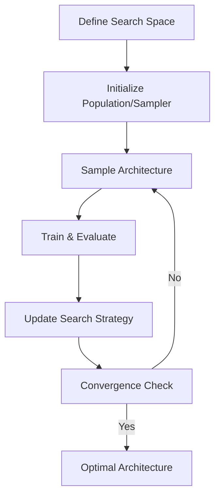

**Category:** Model Optimization Services
**Difficulty:** Intermediate
**Reading time:** 6 min read

---

Neural Architecture Search automates the design of neural network architectures by searching over architecture spaces using various strategies. NAS discovers models optimized for specific constraints (latency, memory, accuracy) without manual design, accelerating the optimization process.

- **Search Space** — Range of possible architecture configurations
- **Search Strategy** — Methods for exploring architectures (evolutionary, Bayesian, reinforcement learning)
- **Performance Estimation** — Efficient evaluation of candidate architectures
- **Multi-Objective Optimization** — Balancing accuracy, latency, and memory
- **Transferable Search** — Architectures found on small problems apply to larger ones

NAS defines a search space of possible architectural components (layer types, kernel sizes, skip connections). A search strategy explores this space systematically: evolutionary algorithms maintain populations and apply mutations/crossover; Bayesian methods use surrogate models; reinforcement learning trains agents to design architectures. Each candidate is trained and evaluated for accuracy, latency, and memory. Performance estimation techniques (weight sharing, early stopping) accelerate evaluation. Multi-objective optimization balances competing metrics—finding Pareto-optimal architectures. Successfully discovered architectures often transfer to different tasks and datasets, enabling reuse across domains.

- Designing optimal models for resource constraints
- Mobile architecture discovery for specific hardware
- AutoML pipeline optimization
- Finding efficient architectures for edge deployment
- Ensemble architecture generation
- Federated learning architecture design

| Advantage | Disadvantage |
|-----------|--------------|
| Automated design reduces manual effort | Computationally expensive search process |
| Finds efficient architectures | Requires large-scale training infrastructure |
| Optimizes for specific constraints | Long search times (days to weeks) |
| Architectures often transfer well | Limited by search space definition |
| Enables multi-objective optimization | Reproducibility and randomness issues |

- [AutoML for Model Optimization](automl-for-model-optimization.md)
- [Knowledge Distillation](knowledge-distillation.md)
- [Model Compression Frameworks](model-compression-frameworks.md)

---
*Part of the [Model Optimization Services](index.md) category · [Back to Master Index](../../index.md)*
